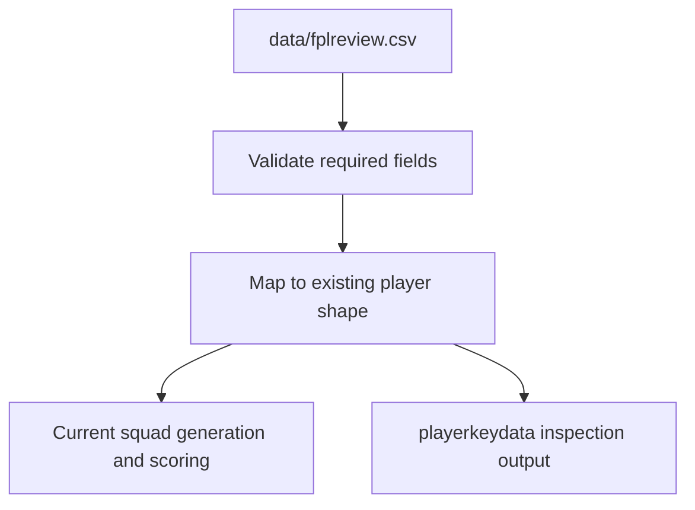

# Requirements: fplreview CSV Import

## Summary

FPLgen will replace its old three-file runtime data input with a single fplreview.com CSV export at `data/fplreview.csv`. The importer will map that CSV into the existing internal player shape so the current optimizer can keep running with minimal downstream logic changes, using fplreview gameweek points as the final expected score for each configured gameweek.

---

## Problem Frame

The current repo was written against an older Fantasy Premier League data shape. It expects `playerdata`, `fixturedata`, and `playerlast10.csv`, then applies local projection logic before scoring teams. The FPL APIs and surrounding tooling have changed since then, and the more useful source of truth is now a single fplreview.com export file.

This change should modernize the input path without turning into an optimizer rewrite. fplreview projections already include availability and expected-minutes effects, so FPLgen should import those values directly and avoid re-adjusting them.

---

## Key Decisions

- **Use fplreview CSV as the only runtime input.** The old three-file data path should no longer be the normal supported runtime flow.
- **Keep the app logic mostly intact.** The import layer adapts fplreview data into the current internal representation instead of forcing the GA, scoring, and transfer code to learn a new data shape.
- **Treat fplreview points as final expected values.** Gameweek points from the CSV are the player scores for those gameweeks, with no strength-of-schedule, home/away, availability, or xMins adjustment added by FPLgen.
- **Keep hard-coded gameweek settings for now.** The importer validates against the current configured `gameweek` and `forecastweeks` values rather than introducing CLI configuration in this change.
- **Keep `playerkeydata` for inspection.** It remains as a generated artifact, but its role becomes showing loaded projection values rather than explaining FPLgen-adjusted projections.

---

## Requirements

**Input and validation**

- R1. FPLgen reads runtime projection data from `data/fplreview.csv`.
- R2. The fplreview CSV must include full optimizer-ready player fields: player ID, player name, team, position, buying value, selling value, and gameweek points for each configured forecast week.
- R3. The importer fails fast with a clear error when a required player field is missing.
- R4. The importer fails fast with a clear error when the CSV does not include the gameweek point columns required by the current hard-coded `gameweek` and `forecastweeks` settings.
- R5. The importer treats all fplreview-imported players as internally available because fplreview expected points already account for availability and expected minutes.

**Field mapping**

- R6. The importer maps fplreview player fields into the existing internal player shape used by current squad generation, validation, scoring, transfer, and output code.
- R7. The importer maps fplreview position values into the existing internal position representation.
- R8. The importer maps fplreview team values into the existing internal team and team-name representation.
- R9. For new squad generation, player cost comes from fplreview buying value.
- R10. For transfers, imported data must preserve both selling value for outgoing-player affordability and buying value for incoming-player affordability, without changing the existing transfer logic in this feature.
- R11. Imported gameweek point values become the existing per-week player score fields used by scoring.

**Runtime behavior**

- R12. Existing scoring, squad generation, transfer, budget, chip, and team-validity behavior should remain unchanged except where a small compatibility change is unavoidable to consume the mapped fplreview fields.
- R13. FPLgen should not call live FPL APIs as part of this feature.
- R14. FPLgen should not apply the old projection calculation path to fplreview-imported gameweek points.
- R15. `playerkeydata` should still be written after import and should reflect the imported fplreview projection values.

**Tests and documentation**

- R16. The repo includes a committed synthetic fplreview-format CSV fixture for import and field-mapping tests.
- R17. The synthetic fixture proves import and mapping behavior only; it does not need enough players to support an end-to-end GA run.
- R18. README documentation is updated so the normal quick-start data path tells users to put the fplreview export at `data/fplreview.csv`.
- R19. README documentation no longer presents `playerdata`, `fixturedata`, and `playerlast10.csv` as the normal runtime input flow.

---

## Key Flow

- F1. Import fplreview projections
  - **Trigger:** The user runs FPLgen with `data/fplreview.csv` present.
  - **Steps:** FPLgen reads the CSV, validates required fields and configured gameweek columns, maps fplreview values into the existing internal player representation, and makes the mapped players available to the current optimizer.
  - **Outcome:** The current GA/scoring pipeline runs against fplreview expected points without applying old projection adjustments.
  - **Covered by:** R1-R15

---

## Acceptance Examples

- AE1. **Covers R2, R3.** Given `data/fplreview.csv` is missing the player position field, when FPLgen imports data, then import stops with a clear missing-field error.
- AE2. **Covers R4.** Given the configured horizon requires six gameweek point columns and the CSV omits one, when FPLgen imports data, then import stops before running the optimizer.
- AE3. **Covers R9, R10.** Given a player row includes both buying value and selling value, when that player is mapped, then the internal player has the buying value available for new-squad cost and the selling value preserved for existing transfer affordability behavior.
- AE4. **Covers R11, R14.** Given a player has fplreview points for the configured gameweeks, when the player is imported, then those values become the weekly score fields used by scoring without local projection adjustment.
- AE5. **Covers R16, R17.** Given the committed synthetic fixture, when import tests run, then they verify required-column validation and internal field mapping without requiring a legal 15-player optimizer corpus.

---

## Scope Boundaries

- Current-squad import, manager-team sync, and replacement of hard-coded current-squad behavior are deferred.
- CLI input configuration, random seed controls, and generation-limit controls are deferred.
- End-to-end GA smoke testing moved to the separate golden fplreview fixture item, now completed in PR https://github.com/markbarrington/fplgen/pull/4.
- Refactoring the optimizer around a new projection model is out of scope for this change.
- Live FPL API integration is out of scope for this change.

---

## Dependencies and Assumptions

- fplreview exports remain CSV files with player details, buying/selling price, expected value, expected minutes, and gameweek breakdown columns.
- The implementation can identify stable fplreview column names for player ID, name, team, position, buying value, selling value, and gameweek points.
- Existing hard-coded `gameweek` and `forecastweeks` settings remain the source of truth for which gameweek point columns are required.
- The old internal representation is still sufficient for the current GA and scoring logic once fplreview fields are mapped into it.

---

## Sources

- Ideation seed: `docs/ideation/2026-06-02-repo-improvements-ideation.md`
- Existing runtime docs: `README.md`
- Current loader and scoring code: `code/fpl.py`
- Current runner: `code/GA.py`
- Existing smoke tests: `tests/test_fpl_smoke.py`
- fplreview export docs: https://docs.fplreview.com/the-model/planner-interface/export_projections/
- fplreview upload docs: https://docs.fplreview.com/the-model/planner-interface/upload_projections/
