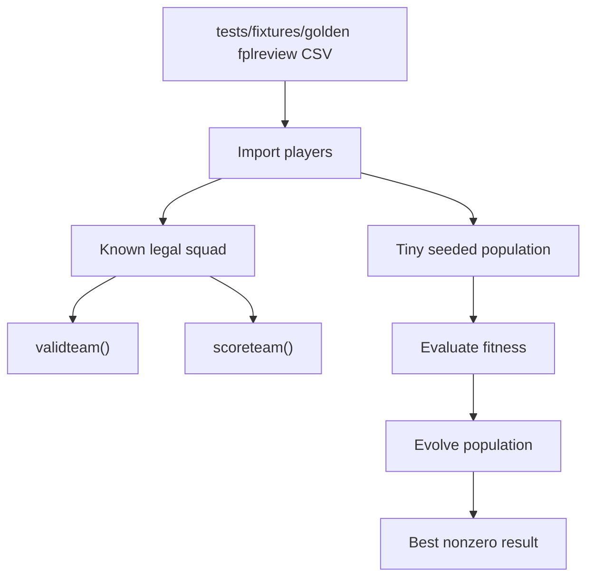

# Requirements: Golden fplreview Fixture

## Summary

FPLgen should add a golden fplreview-style fixture and end-to-end validation tests that prove the old codebase can still complete an import-to-result loop. The first version should use a stable synthetic corpus, deterministic test runs, and concise README guidance so future work has a trusted safety check before deeper optimizer changes.

---

## Problem Frame

FPLgen has not been actively touched for several years, and the current priority is confidence rather than feature expansion. The repo now imports a single fplreview.com CSV, but the existing committed fixture only proves basic field mapping with four rows. It does not prove that the codebase can generate a valid team, score that team, or survive a small GA evolution path.

The golden fixture is therefore a re-entry harness: it should answer whether the current project still functions end to end, while staying narrow enough that it does not become the separate configurable-runner or optimizer-refactor work.

---

## Key Decisions

- **Use a stable synthetic golden fixture first.** The committed safety check should not depend on live APIs, real-season data drift, or third-party projection availability. A later optional real-export check can add realism without making the core test brittle.
- **Validate both a known squad and a tiny GA path.** A known legal squad gives a stable baseline for import, validation, and scoring. A small population/evolution smoke test proves the random search path still connects.
- **Allow tiny testability seams.** This work may add minimal helpers or parameters needed to run a short deterministic GA path. It should not turn into the full configurable CLI runner.
- **Make the safety check reproducible and discoverable.** Deterministic seeding and README instructions are part of the value because the goal is future re-entry into an old codebase.

---

## Requirements

**Golden fixture**

- R1. Add a committed synthetic fplreview-style CSV fixture under `tests/fixtures/` that is large enough to support at least one valid 15-player squad.
- R2. The fixture must preserve the fplreview import column shape used by the current importer, including `Pos`, `ID`, `Name`, `BV`, `SV`, `Team`, and the configured gameweek point columns.
- R3. The fixture must include enough positional coverage for the current squad requirements: 2 goalkeepers, 5 defenders, 5 midfielders, and 3 forwards at minimum.
- R4. The fixture must avoid accidental invalidity under the current `validteam()` behavior, including budget, duplicate-player, max-three-per-club, and current per-position club-name checks.
- R5. The fixture should include a modest surplus beyond the exact 15-player squad so random team generation and mutation have alternatives without requiring a full real-season player pool.
- R6. The fixture should include low-projection or effectively unavailable-style players through low point values, not by changing imported availability status, because fplreview points are already treated as final expected values.

**Known-squad validation**

- R7. Add a deterministic test that imports the golden fixture and constructs a known legal 15-player squad from named or ID-based fixture rows.
- R8. The known squad must pass `validteam()` and stay within the current budget.
- R9. The known squad must produce a nonzero `scoreteam()` result using the imported gameweek point fields.
- R10. The known-squad test should assert a stable expected score or a narrow score condition strong enough to catch broken scoring input wiring.

**GA smoke validation**

- R11. Add a deterministic smoke test that imports the golden fixture, creates a tiny population, evaluates fitness, evolves for at least one generation, and confirms the best result is nonzero.
- R12. The GA smoke path should use explicit seeding so failures are reproducible.
- R13. The GA smoke path may use a minimal helper or parameterized function to avoid invoking `code/GA.py`'s current 10,000-individual, 300-generation script behavior.
- R14. The GA smoke test should verify that the fittest returned individual is structurally compatible with `validteam()` and `scoreteam()`, while tolerating that crossover or mutation can still create invalid individuals internally.

**Documentation and manual re-entry**

- R15. Update `README.md` with a concise development safety-check command that runs the golden fixture tests.
- R16. README guidance should make clear that the fixture is synthetic and intended to prove repo functionality, not model real FPL projection quality.
- R17. README guidance should distinguish the committed synthetic fixture from any future optional real-export validation.

---

## Key Flows

- F1. Known-squad safety check
  - **Trigger:** A developer runs the test suite after returning to the repo or changing import/scoring behavior.
  - **Steps:** The test imports the golden CSV, selects the known legal squad, validates squad constraints, and scores the squad.
  - **Outcome:** The repo proves that imported fplreview-style data can reach scoring with a stable nonzero result.
  - **Covered by:** R1-R10

- F2. Tiny GA safety check
  - **Trigger:** A developer runs the end-to-end smoke tests.
  - **Steps:** The test imports the golden CSV, seeds randomness, creates a small population, evaluates fitness, evolves once or a few times, and checks the best result.
  - **Outcome:** The repo proves that import, random team generation, fitness evaluation, and evolution still connect without running the full production-sized script.
  - **Covered by:** R1-R6, R11-R14

---

## Acceptance Examples

- AE1. **Covers R1-R4, R7-R9.** Given the committed golden fixture, when the known squad test imports and selects its expected 15 players, then `validteam()` returns true and `scoreteam()` returns a nonzero score.
- AE2. **Covers R10.** Given a future importer change drops or misaligns weekly projection fields, when the known squad score test runs, then the test fails because the expected score or score condition no longer holds.
- AE3. **Covers R11-R14.** Given the committed golden fixture and a fixed random seed, when the tiny GA smoke test runs, then it creates a small population, evolves at least once, and reports a nonzero fittest score without invoking the full `code/GA.py` script loop.
- AE4. **Covers R15-R17.** Given a developer returns to the repo later, when they read `README.md`, then they can identify the safety-check command and understand that the golden fixture is synthetic validation data.

---

## Scope Boundaries

- Refactoring `code/GA.py` into a full configurable CLI is deferred to the separate GA runner improvement.
- Replacing the GA, changing selection/mutation strategy, or repairing invalid evolved individuals is out of scope for this fixture item.
- Importing or committing a real fplreview export is deferred; the first golden fixture should be synthetic.
- Live FPL API calls, fplcache fixtures, and theFPLkiwi-derived fixtures are out of scope for this first safety check.
- Changing FPL scoring rules, chip behavior, transfer behavior, or the current `validteam()` rule set is out of scope unless a test exposes a direct compatibility break.

---

## Dependencies and Assumptions

- The existing fplreview importer remains the normal runtime import path.
- Current hard-coded `gameweek` and `forecastweeks` settings define which gameweek point columns the fixture must include.
- Current `validteam()` behavior is treated as the behavior under test, even where it may be stricter than current FPL rules.
- A synthetic fixture with modest surplus players is enough to prove the repo still functions, even if it is not enough to judge optimizer quality.

---

## Sources

- Ideation seed: `docs/ideation/2026-06-02-repo-improvements-ideation.md`
- Prior import requirements: `docs/brainstorms/2026-06-02-fplreview-import-requirements.md`
- Current importer and scoring code: `code/fpl.py`
- Current GA runner: `code/GA.py`
- Current population and evolution code: `code/Population.py`, `code/Individual.py`, `code/Algorithm.py`
- Existing import tests and minimal fixture: `tests/test_fplreview_import.py`, `tests/fixtures/fplreview_minimal.csv`
