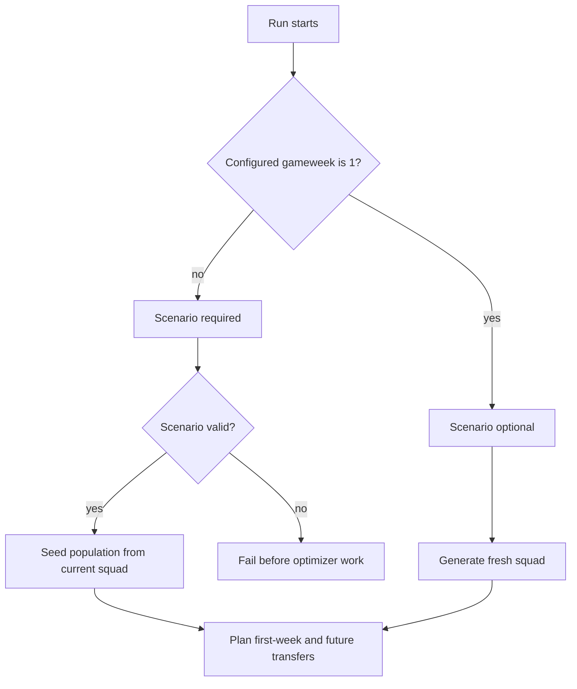

# Existing Squad Scenario Requirements

## Summary

Add a situation-only scenario file for FPLgen runs. GW1 runs can continue generating a fresh squad without a scenario file; non-GW1 runs must start from a valid current squad, current bank, and saved free transfers supplied by the user.

---

## Problem Frame

FPLgen currently behaves as though the optimizer can create a new squad for the first forecast week and then plan transfers after that. That is valid for the first gameweek of a season, and the existing wildcard behavior covers a full squad rebuild during a later gameweek.

The normal FPL use case is different. Most runs happen mid-season, when the manager already owns a squad, has a known bank, and has a known number of saved free transfers. For those runs, the optimizer must preserve the real starting squad and plan from that state. Generating a new initial squad would produce an impossible recommendation.

The first version should introduce the minimum durable input contract for that state without turning the scenario file into a general run-configuration system.

---

## Key Decisions

- **GW1 is the only fresh-squad path.** If the configured gameweek is 1, no scenario file is required and FPLgen may generate a new squad within budget.
- **Non-GW1 requires owned squad state.** If the configured gameweek is not 1, the run must have a scenario file with current squad, bank, and saved free transfers.
- **Scenario files describe FPL situation only.** Runtime controls such as input CSV, forecast weeks, population size, generation limit, and seed remain CLI concerns for this version.
- **Current squad players are identified by FPL ID.** Name matching is deferred so the first version has a stable, unambiguous identity contract.
- **Bank is written as a human decimal.** Scenario files use values like `0.7` for 0.7m in the bank, then FPLgen converts that to its internal price convention.
- **First-week transfers are available for non-GW1 runs.** The first forecast week represents the current actionable deadline, not a generated starting week.
- **Existing chip behavior is preserved.** This feature should not add Free Hit, remove All Out Attack, or redesign Wildcard, Bench Boost, or Triple Captain unless a narrow compatibility change is required for existing-squad planning.
- **Generated scenarios are for testing and demos.** A utility should create valid sample scenario files from an input projection CSV, but real non-GW1 optimization still depends on the user supplying their actual squad.

---

## Requirements

**Scenario Input**

- R1. FPLgen accepts an optional scenario file that describes the user's FPL situation for the run.
- R2. The first scenario-file version includes only FPL situation fields: configured gameweek, current squad, current bank, and saved free transfers.
- R3. Runtime controls remain outside the scenario file in this version, including input projection path, forecast weeks, population size, generation limit, random seed, and output preferences.
- R4. When the configured gameweek is 1, the scenario file is optional and the existing fresh-squad generation path remains valid.
- R5. When the configured gameweek is not 1, FPLgen requires a scenario file before optimizer work begins.
- R6. For non-GW1 scenarios, the current squad is supplied as 15 FPL player IDs.
- R7. The scenario bank is supplied as a decimal FPL money value, such as `0.7` for 0.7m.
- R8. Saved free transfers are supplied as a whole number and must be valid under the rules FPLgen supports for this feature.

**Scenario Validation**

- R9. FPLgen validates a non-GW1 scenario before creating a population or scoring any team.
- R10. Scenario validation requires exactly 15 current squad IDs.
- R11. Scenario validation rejects duplicate current squad IDs.
- R12. Scenario validation requires every current squad ID to exist in the loaded projection CSV.
- R13. Scenario validation requires the current squad to satisfy FPL squad structure: 2 goalkeepers, 5 defenders, 5 midfielders, and 3 forwards.
- R14. Scenario validation rejects squads with more than 3 players from the same club.
- R15. Scenario validation rejects malformed bank values and saved-free-transfer values.
- R16. Scenario validation fails with a clear user-facing reason when the scenario is invalid.

**Optimizer Behavior**

- R17. For non-GW1 runs, every initial individual starts from the supplied current squad rather than a randomly generated squad.
- R18. For non-GW1 runs, the optimizer may make transfers in the first forecast week.
- R19. For non-GW1 runs, transfer affordability starts from the scenario bank rather than deriving bank from fresh budget minus current squad value.
- R20. Existing future-transfer planning remains available after the first forecast week.
- R21. Existing Wildcard, Bench Boost, and Triple Captain behavior remains available as currently implemented, unless it directly conflicts with the supplied starting squad.
- R22. Free Hit support is not added by this feature.
- R23. All Out Attack removal is not part of this feature.

**Scenario Generation Utility**

- R24. FPLgen includes a developer/test utility that generates a valid scenario file from a loaded projection CSV or projection CSV path.
- R25. The generated scenario includes a valid 15-player squad by FPL ID, a valid gameweek, a decimal bank value, and saved free transfers.
- R26. The generated scenario is explicitly positioned as a test/demo scenario, not a representation of a real manager's current squad.
- R27. The generated scenario utility supports repeatable output when supplied the same inputs and deterministic controls.
- R28. Generated scenarios can be used by tests to exercise non-GW1 existing-squad behavior without hand-maintaining large scenario fixtures.

**Output and User Feedback**

- R29. When a non-GW1 scenario is used, run output makes clear that the optimizer started from an existing squad.
- R30. Output includes enough starting-state context for the user to verify the run: gameweek, bank, saved free transfers, and current squad source.
- R31. Validation errors point to the scenario problem rather than failing later inside population creation, scoring, or transfer evaluation.

---

## Key Flows

- F1. GW1 fresh-squad run
  - **Trigger:** User runs FPLgen with gameweek 1 and no scenario file.
  - **Actors:** Manager, FPLgen.
  - **Steps:** FPLgen loads projections, generates a fresh valid squad, and optimizes using the existing fresh-squad behavior.
  - **Outcome:** Existing GW1 behavior remains available.
  - **Covered by:** R4.

- F2. Non-GW1 existing-squad run
  - **Trigger:** User runs FPLgen with gameweek greater than 1 and provides a scenario file.
  - **Actors:** Manager, FPLgen.
  - **Steps:** FPLgen loads projections, validates the scenario, seeds the optimizer from the supplied squad, applies the scenario bank, and allows transfers in the first forecast week.
  - **Outcome:** The optimizer recommends from the user's real starting state instead of generating a new initial squad.
  - **Covered by:** R5-R20, R29-R30.

- F3. Invalid scenario rejected
  - **Trigger:** User provides a scenario with invalid squad structure, missing IDs, duplicate IDs, invalid bank, or invalid saved free transfers.
  - **Actors:** Manager, FPLgen.
  - **Steps:** FPLgen validates the scenario before optimization and reports the invalid field or rule.
  - **Outcome:** No population is created and no misleading transfer plan is produced.
  - **Covered by:** R9-R16, R31.

- F4. Generated test scenario
  - **Trigger:** Developer asks FPLgen to generate a valid scenario from a projection CSV.
  - **Actors:** Developer, FPLgen.
  - **Steps:** FPLgen selects a legal 15-player squad from the projection data, assigns valid situation values, and writes or returns a scenario suitable for tests and demos.
  - **Outcome:** Tests can cover existing-squad behavior without relying on a hand-written real manager team.
  - **Covered by:** R24-R28.

---

## Acceptance Examples

- AE1. Covers R4. Given the configured gameweek is 1 and no scenario file is provided, when FPLgen runs, then it uses the existing fresh-squad generation behavior.
- AE2. Covers R5, R31. Given the configured gameweek is 8 and no scenario file is provided, when FPLgen starts, then it fails before optimizer work begins with a clear missing-scenario message.
- AE3. Covers R6, R10-R14. Given a non-GW1 scenario supplies 15 unique IDs that all exist in the projection CSV and form a legal FPL squad, when FPLgen validates the scenario, then validation passes.
- AE4. Covers R11. Given a non-GW1 scenario includes the same player ID twice, when FPLgen validates the scenario, then validation fails before population creation.
- AE5. Covers R12. Given a non-GW1 scenario includes a player ID absent from the projection CSV, when FPLgen validates the scenario, then validation fails before population creation.
- AE6. Covers R13-R14. Given a non-GW1 scenario has the wrong position counts or too many players from one club, when FPLgen validates the scenario, then validation fails with a squad-rule reason.
- AE7. Covers R17-R19. Given a valid GW12 scenario with bank `0.7` and saved free transfers, when FPLgen creates the initial population, then individuals start from the supplied squad and first-week transfer affordability uses the scenario bank.
- AE8. Covers R18, R20. Given a valid non-GW1 scenario, when FPLgen scores a candidate plan, then transfers may be applied in the first forecast week and future planned transfers remain available.
- AE9. Covers R21-R23. Given existing chip flags are configured as they are today, when this feature is used, then Wildcard, Bench Boost, Triple Captain, and All Out Attack behavior is not broadened or removed by this feature.
- AE10. Covers R24-R28. Given a projection CSV with enough valid players, when the scenario generation utility runs with deterministic controls, then it produces a repeatable valid scenario suitable for tests.

---

## Scope Boundaries

### Deferred for Later

- Adding runtime controls to scenario files.
- Name-based or fuzzy player matching for current squads.
- Live FPL team sync from a manager account or public team endpoint.
- Free Hit implementation.
- Removing All Out Attack.
- Broader chip model modernization.
- Locked-deadline scenarios where the first forecast week cannot make transfers.
- A full `RunConfig` or `FplContext` refactor beyond what this feature directly requires.

### Out of Scope

- Replacing the genetic algorithm.
- Changing projection import semantics for fplreview CSVs.
- Changing scoring rules unrelated to starting from an existing squad.
- Turning generated test scenarios into claimed real-manager scenarios.

---

## Dependencies and Assumptions

- The projection CSV remains the source of player identity, position, team, price, sell price, and forecast points for this feature.
- Current squad IDs in the scenario file are FPL IDs that match IDs in the loaded projection CSV.
- Existing CLI controls continue to set input path, gameweek, forecast weeks, population, generation limit, and seed.
- The current code's integer price convention remains internal; decimal scenario bank values are converted at the boundary.
- Scenario generation for tests only needs to produce a valid legal squad, not a high-quality or realistic manager squad.

---

## Sources and Research

- Prior ideation: `docs/ideation/2026-06-02-repo-improvements-ideation.md`
- Configuration ideation: `docs/ideation/2026-06-02-hardcoded-elements-config-ideation.md`
- Configurable runner requirements: `docs/brainstorms/2026-06-03-configurable-ga-runner-requirements.md`
- Current runner controls: `code/GA.py`
- Current squad generation and scoring behavior: `code/fpl.py`
- Current individual initialization: `code/Individual.py`
- Current runner tests: `tests/test_ga_runner.py`
- Existing fplreview fixture tests: `tests/test_fplreview_golden.py`, `tests/test_fplreview_import.py`
