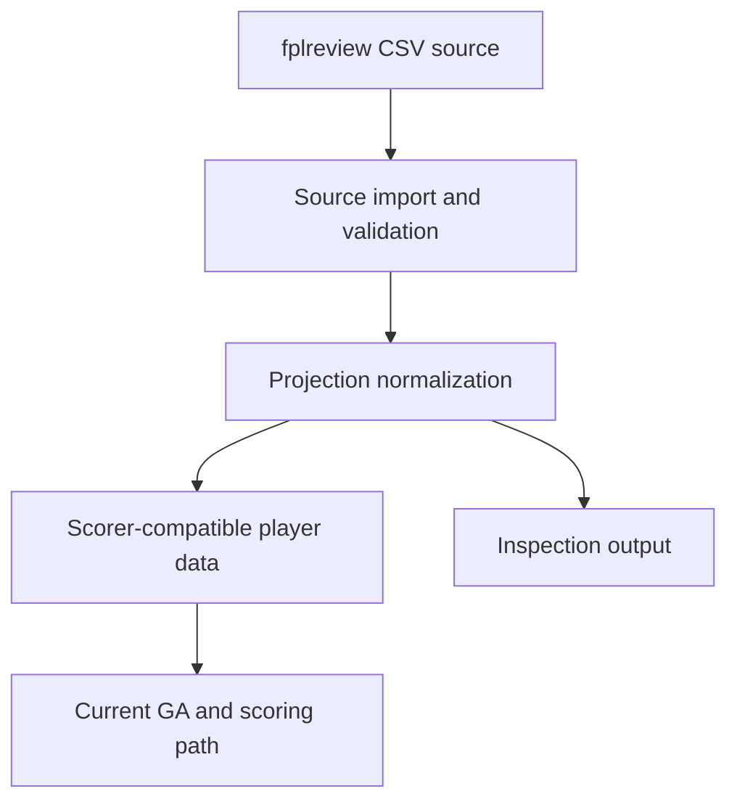

# Requirements: Import, Projection, and Scoring Boundaries

## Summary

FPLgen will split the current fplreview data path into explicit import, projection normalization, scoring-input, and inspection-output boundaries. The first version should preserve current optimizer behavior while making the data path easier to test, reason about, and extend toward future run-state and projection-model work.

---

## Problem Frame

FPLgen now has a practical fplreview CSV import path, a configurable runner, historical projection fixtures, and existing-squad scenarios. That restored the product workflow, but much of the data path still lives inside `code/fpl.py` as one blended responsibility.

The current fplreview path validates CSV fields, maps rows into scorer-ready player dictionaries, assigns global player state, derives projection summary fields, and writes `playerkeydata` for inspection. Scoring then reads the same mutable player shape and shared module state. This makes each change harder to reason about because import behavior, projection semantics, scorer expectations, and debug output are coupled.

The next improvement should introduce clearer boundaries without turning into a full rewrite. The useful move is to make each stage visible and testable, keep the current optimizer contract intact, and leave a cleaner stepping stone toward a future `RunConfig` or `FplContext`.

---

## Key Decisions

- **Boundary-first, behavior-preserving refactor.** The refactor should make responsibilities explicit without changing squad recommendations, scoring semantics, transfer behavior, chip behavior, or runner defaults.
- **Small cleanup changes are allowed.** If the touched path exposes low-risk awkward coupling or duplicated validation, the implementation may clean it up as part of the boundary split.
- **Current player shape remains the scorer contract for v1.** Planning may introduce intermediate structures, but the GA and scoring path should not be forced to consume a new domain model in this pass.
- **Projection values stay final EV inputs.** fplreview gameweek points remain the expected scores used by scoring, with no new local availability, minutes, strength-of-schedule, or home-away adjustment.
- **This prepares for `FplContext`; it does not require it.** The work should reduce future context-migration risk, but full ownership of players, budget, gameweek, chip flags, and scoring constants is deferred.

---

## Requirements

**Import and validation boundary**

- R1. The fplreview source import must be distinguishable from projection normalization, scoring preparation, global state assignment, and inspection output.
- R2. Source validation must still fail fast when required fplreview identity, price, team, position, or configured gameweek point fields are missing.
- R3. Source import must remain path-driven so the runner, tests, and fixture utilities can load explicit CSV files.
- R4. Import validation errors should identify source-data problems before optimizer population creation.

**Projection normalization boundary**

- R5. Projection normalization must convert fplreview rows into normalized player/projection data that preserves FPL ID, display name, team, position, buy value, sell value, and each configured gameweek EV.
- R6. Normalization must continue to derive current summary values needed by the existing scorer and output path, including this-week points, lookahead points, average projected points, and total projection fields.
- R7. fplreview gameweek EVs must flow into scoring without additional local projection adjustment.
- R8. Normalization must preserve team and position mapping behavior currently covered by importer tests.

**Scoring input boundary**

- R9. The scorer-facing input must retain the fields and semantics required by current squad generation, validation, transfer affordability, chips, and weekly scoring.
- R10. Existing GW1 fresh-squad behavior and non-GW1 scenario behavior must remain unchanged.
- R11. Scenario validation must still resolve current-squad IDs against the loaded player pool before optimization.
- R12. Scoring behavior must remain testable independently from source CSV parsing wherever existing fixtures make that practical.

**Inspection output boundary**

- R13. `playerkeydata` should remain available as an inspection artifact after player data is loaded.
- R14. Inspection output should be downstream of normalized projection data rather than part of source import itself.
- R15. The inspection output must continue to reflect the configured forecast horizon and loaded projection values.

**Regression and compatibility**

- R16. Existing fplreview import, golden fixture, historical projection fixture, scenario, and GA runner tests must continue to pass.
- R17. New or updated tests must prove that boundary extraction preserves normalized player values and scorer-visible behavior for representative fixtures.
- R18. Any small cleanup change included in this work must be covered by characterization or regression tests when it could affect optimizer behavior.
- R19. Documentation should continue to describe the same user-facing run workflow unless the implementation exposes a clearer way to explain the data path.

---

## Key Flow

- F1. Load projections for a run
  - **Trigger:** A user or test runs FPLgen with a fplreview-style CSV path.
  - **Steps:** FPLgen validates the source CSV, normalizes projection data, prepares scorer-compatible player data, publishes it to the current run path, and writes inspection output.
  - **Outcome:** The optimizer sees the same effective player pool and projection scores as before, but each stage can be tested and evolved separately.
  - **Covered by:** R1-R17

---

## Acceptance Examples

- AE1. **Covers R1-R4.** Given a fplreview fixture is missing a required gameweek point column, when FPLgen loads projections, then the run fails before scenario validation or population creation.
- AE2. **Covers R5-R8.** Given a valid fplreview fixture row, when projection normalization runs, then the normalized data preserves identity, position, team, buy value, sell value, weekly EVs, and derived projection summary values.
- AE3. **Covers R7, R9, R16.** Given the golden fplreview fixture, when the boundary split is applied, then known-squad scoring produces the same behavior as the pre-refactor path.
- AE4. **Covers R10-R12.** Given a non-GW1 scenario, when the runner loads projections and validates the scenario, then the current squad resolves against the loaded player pool and starts optimization with the same scenario semantics.
- AE5. **Covers R13-R15.** Given a configured forecast horizon, when player data is loaded, then `playerkeydata` is written from normalized projection values for the same horizon.
- AE6. **Covers R18.** Given a cleanup change touches a scorer-visible value, when tests run, then a focused regression test proves the value or behavior did not unintentionally change.

---

## Scope Boundaries

- New projection models, EV blending, uncertainty distributions, expected-minutes adjustments, and source-disagreement analysis are deferred.
- Full `RunConfig` or `FplContext` migration is deferred.
- Full removal of global state from scoring, chips, transfers, and GA orchestration is deferred.
- Broad scoring-rule edge-case coverage is deferred except where needed to prove boundary behavior.
- Exact solver benchmarking and optimizer-quality metrics are deferred.
- Live FPL API integration and fplcache state ingestion are out of scope for this item.
- Replacing the current player dictionary contract across the GA and scorer is out of scope for v1.

---

## Dependencies and Assumptions

- fplreview-style CSV remains the current runtime projection source.
- Existing fixtures are sufficient to prove boundary-preserving behavior for the first pass.
- Current scorer and GA code can continue consuming the existing player shape while the upstream data path becomes clearer.
- `playerkeydata` is still useful as a local inspection artifact, even if its generation moves behind a clearer output boundary.
- Some legacy fixture-based projection code may remain in place if removing it would broaden the refactor beyond the staged goal.

---

## Sources

- Ideation seed: `docs/ideation/2026-06-02-repo-improvements-ideation.md`
- fplreview import requirements: `docs/brainstorms/2026-06-02-fplreview-import-requirements.md`
- Existing-squad scenario plan: `docs/plans/2026-06-03-003-feat-existing-squad-scenario-plan.md`
- Current runner: `code/GA.py`
- Current import, projection, inspection, and scoring code: `code/fpl.py`
- Scenario validation: `code/scenario.py`
- Existing regression fixtures and tests: `tests/fixtures/`, `tests/test_fplreview_import.py`, `tests/test_fplreview_golden.py`, `tests/test_fplkiwi_historical_fixture.py`, `tests/test_existing_squad_optimizer.py`, `tests/test_ga_runner.py`
