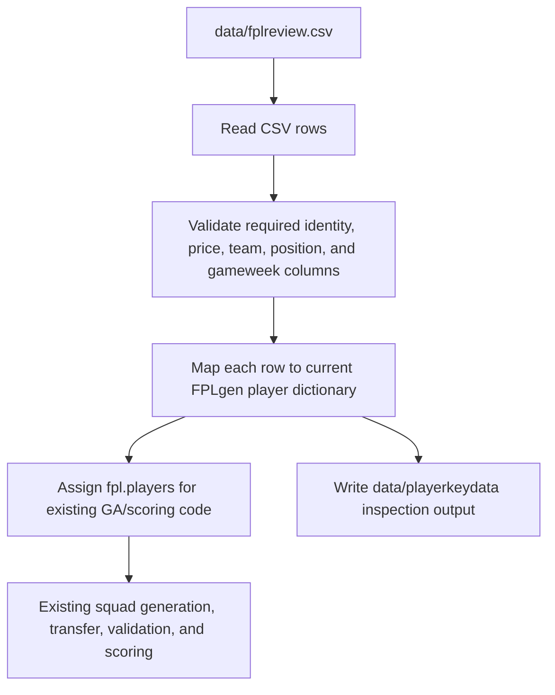

# feat: Import fplreview CSV projections

## Summary

Replace FPLgen's old three-file runtime data import with a single fplreview.com CSV at `data/fplreview.csv`. The implementation should map fplreview fields into the existing internal player shape so current squad generation, scoring, transfers, and inspection output can keep working with minimal downstream logic change.

---

## Problem Frame

The repo currently imports `playerdata`, `fixturedata`, and `playerlast10.csv`, then calculates local projections in `code/fpl.py`. The requirements doc establishes that this old data path no longer matches the preferred workflow: fplreview projections should become the source of truth, and `GW_Pts` values should be used directly as expected points for each configured gameweek.

The key implementation challenge is compatibility. FPLgen's GA and scoring code expect player dictionaries with fields such as `id`, `code`, `second_name`, `team`, `team_name`, `element_type`, `now_cost`, `sellprice`, `status`, weekly string keys, `lookaheadpoints`, `thisweekpoints`, `ppg`, and `otherteams`. The plan should preserve those expectations while changing where the data comes from.

---

## Requirements

**Input and validation**

- R1. FPLgen reads runtime projection data from `data/fplreview.csv`.
- R2. The importer validates that the CSV has player identity, team, position, buying value, selling value, and configured gameweek points.
- R3. Missing required fields or configured gameweek columns fail fast before optimizer work begins.
- R4. All imported players are internally available because fplreview expected points already include availability and expected-minutes effects.

**Mapping and compatibility**

- R5. fplreview fields are mapped into the existing internal player dictionary shape.
- R6. fplreview position and team values are normalized into the existing position and team representations used by validation and scoring.
- R7. `BV` maps to the internal buying cost used by new squad generation.
- R8. `SV` is preserved as the internal selling price used by existing transfer affordability logic.
- R9. Configured gameweek point columns map directly to internal week score fields without local projection adjustment.
- R10. Existing scoring, squad generation, transfer, chip, budget, and validity behavior remain unchanged except for small compatibility changes needed to consume mapped fplreview players.

**Inspection, tests, and docs**

- R11. `playerkeydata` continues to be written and reflects loaded fplreview values.
- R12. A committed synthetic fplreview-format CSV fixture covers import and mapping behavior without needing a legal optimizer-sized player pool.
- R13. README documentation describes `data/fplreview.csv` as the normal runtime input and stops presenting the old three-file flow as the standard path.

---

## Key Technical Decisions

- **Thin adapter over application rewrite:** Implement fplreview parsing and validation at the import boundary, then feed mapped player dictionaries to existing logic. This directly follows the requirements' minimum-change constraint.
- **Keep `fpl.getplayerdata()` as the public loading entrypoint:** `code/GA.py` already calls `fpl.getplayerdata()`. Keeping that entrypoint avoids a runner change and confines most work to loader behavior.
- **Factor parsing into testable helpers:** The loader should delegate CSV reading, validation, and row mapping to focused helpers so tests can exercise import behavior without running `GA.py` or building a valid full squad.
- **Column handling is a compatibility contract:** fplreview docs name fields such as `Pos`, `ID`, `Name`, `BV`, `SV`, `Team`, and gameweek `GW_xMins` / `GW_Pts` style fields. Keep column-name matching centralized so future fplreview format tweaks do not spread through scoring code.
- **Do not call `lookaheadpoints()` for fplreview imports:** Weekly point fields, `lookaheadpoints`, `thisweekpoints`, and `ppg` should be derived directly from imported CSV values, not from the old fixture/history projection path.

---

## High-Level Technical Design

The importer is the compatibility layer. Everything downstream should see ordinary FPLgen-style players with weekly score fields already populated.

---

## Implementation Units

### U1. Add fplreview import helpers

**Goal:** Create a focused import boundary that can read, validate, and map fplreview CSV rows without invoking the GA.

**Files:**

- `code/fpl.py`
- `tests/test_fplreview_import.py`
- `tests/fixtures/fplreview_minimal.csv`

**Approach:**

- Add a small set of helper functions or static methods near the current loader code for:
  - resolving `data/fplreview.csv`
  - reading CSV rows with headers
  - validating required base columns
  - deriving the required configured gameweek point columns from `gameweek` and `forecastweeks`
  - mapping one CSV row into a current internal player dictionary
- Keep helpers simple and local to the current code style unless implementation reveals that a separate module would reduce coupling without expanding scope.
- Represent imported players as available by setting `status` to `"a"`.
- Populate compatibility fields needed by current code: player identity, `code`, `second_name`, `team`, `team_name`, `element_type`, `now_cost`, `sellprice`, `picked`, `total_points`, `minutes`, `tsp`, `ppg`, `thisweekpoints`, `lookaheadpoints`, weekly string keys, and `otherteams`.
- For `otherteams`, use placeholder values that preserve scoring behavior without reintroducing fixture dependency. Existing scoring checks only need list entries by week to avoid indexing errors and conflict checks.

**Execution note:** Build this test-first around the synthetic fixture and missing-column cases before replacing the runtime loader.

**Test scenarios:**

- Importing the synthetic fixture returns one mapped player per CSV row with expected internal keys.
- A row with `BV` maps to `now_cost`; a row with `SV` maps to `sellprice`.
- Position values map to the existing `element_type` representation for goalkeeper, defender, midfielder, and forward.
- Team values map to internal `team` and `team_name` values consistently enough for `validteam()` and `teamvalue()` to operate.
- Missing a required base column raises a clear import error.
- Missing one configured gameweek point column raises before any mapped players are returned.

**Requirements covered:** R1-R9, R12

### U2. Replace the runtime loader with fplreview CSV import

**Goal:** Make `fpl.getplayerdata()` load `data/fplreview.csv` and stop depending on `playerdata`, `fixturedata`, or `playerlast10.csv`.

**Files:**

- `code/fpl.py`
- `tests/test_fplreview_import.py`

**Approach:**

- Update `getplayerdata()` so it resets global `players` and `fixtures`, imports fplreview rows through the helper boundary, assigns the mapped players to global `players`, and writes `playerkeydata`.
- Do not load or parse old runtime files in the normal path.
- Do not call `lookaheadpoints()` for imported players.
- Keep old projection helpers in place if deleting them would increase blast radius; they can become legacy/deferred cleanup after the fplreview path is stable.
- Ensure import failure occurs before partial global state is left behind.

**Execution note:** Characterize the current `getplayerdata()` side effects first: global reset, `playerkeydata` write, and player field expectations. Then swap the data source while preserving side effects.

**Test scenarios:**

- Calling `getplayerdata()` with a temporary fplreview CSV populates `fpl.players` with mapped players.
- Calling `getplayerdata()` no longer requires `playerdata`, `fixturedata`, or `playerlast10.csv`.
- Failed import from a malformed CSV leaves no partially usable imported player list.
- Imported weekly scores are unchanged from CSV values; no local projection adjustment is applied.

**Requirements covered:** R1, R3-R5, R9-R11

### U3. Preserve scoring and transfer compatibility

**Goal:** Verify that mapped fplreview players can be consumed by current scoring-adjacent behavior without changing optimizer logic.

**Files:**

- `code/fpl.py`
- `tests/test_fplreview_import.py`
- `tests/test_fpl_smoke.py`

**Approach:**

- Add targeted tests against mapped fixture players rather than a full GA corpus.
- Exercise `teamvalue()` and `validteam()` using imported/mapped player dictionaries where practical.
- Verify transfer-price compatibility at the data-shape level: outgoing players expose `sellprice`, incoming players expose `now_cost`.
- Avoid rewriting `scoreteam()`, `transfer()`, `generateteam()`, or `Algorithm` unless tests reveal a direct compatibility break from the mapped fields.

**Test scenarios:**

- A mapped player contributes `BV` through `teamvalue()`.
- A mapped player exposes `sellprice` from `SV`.
- A small constructed squad using mapped player dictionaries can pass or fail `validteam()` for the same reasons as current hand-built dictionaries.
- Imported players have `status = "a"` and are not filtered out by generation/scoring availability checks.

**Requirements covered:** R4-R10

### U4. Update `playerkeydata` inspection output

**Goal:** Keep `data/playerkeydata` as a generated inspection artifact, but make it reflect fplreview-loaded values.

**Files:**

- `code/fpl.py`
- `tests/test_fplreview_import.py`

**Approach:**

- Preserve the existing write path through `data_file("playerkeydata", for_write=True)`.
- Keep the output useful for checking imported player name, team, position, price, this-week points, lookahead points, and weekly point fields.
- Do not attempt to explain projection components that no longer exist in the fplreview import path.

**Test scenarios:**

- Importing the synthetic fixture writes `playerkeydata`.
- The inspection output contains imported weekly point values.
- The inspection output does not depend on old fixture/history fields.

**Requirements covered:** R11

### U5. Refresh README and runtime data guidance

**Goal:** Make the documented path match the new import contract.

**Files:**

- `README.md`

**Approach:**

- Replace the old `playerdata` / `fixturedata` / `playerlast10.csv` normal-flow instructions with `data/fplreview.csv`.
- Explain that fplreview `GW_Pts` values are used as expected points directly.
- Keep the quick start as `python3 code/GA.py` unless implementation changes the runner, which this plan does not require.
- Remove or reframe the old `fplscraper` reference so readers do not treat it as the current input path.
- Mention that `playerkeydata` remains an inspection output.

**Test scenarios:**

- Documentation mentions `data/fplreview.csv` as the standard runtime input.
- Documentation no longer tells users to prepare the old three files for normal use.
- Documentation describes `playerkeydata` consistently with its new role.

**Requirements covered:** R13

---

## Acceptance Examples

- AE1. Given `data/fplreview.csv` lacks `Pos`, import fails with a clear missing-column error before optimizer work starts.
- AE2. Given configured `gameweek` and `forecastweeks` require six gameweek point columns and one is absent, import fails before assigning usable global player data.
- AE3. Given a CSV row contains `BV` and `SV`, the mapped player uses `BV` as `now_cost` and preserves `SV` as `sellprice`.
- AE4. Given a player has configured fplreview gameweek point values, the mapped weekly score fields exactly match those values and are not adjusted by old projection logic.
- AE5. Given the committed synthetic fixture, tests verify import and mapping behavior without requiring a full 15-player legal-squad corpus.

---

## Scope Boundaries

### Deferred to Follow-Up Work

- Current-squad import, manager-team sync, and replacement of hard-coded current-squad behavior.
- CLI input configuration, random seed controls, and generation-limit controls.
- End-to-end GA smoke testing from a full fplreview fixture.
- Cleanup or deletion of old projection helpers after the new import path is stable.

### Out of Scope

- Live FPL API integration.
- Rebuilding the optimizer around a new projection model.
- Changing transfer, scoring, chip, budget, or validity rules beyond compatibility fixes needed for mapped fplreview players.

---

## Risks and Dependencies

- **fplreview column naming drift:** The docs describe the field families, but implementation may need to confirm exact exported headers from a real CSV. Keep column matching centralized and easy to update.
- **Team and position normalization:** The existing code relies on numeric team IDs, team names, and numeric position IDs. Mapping must be explicit enough to avoid silent bad teams.
- **Legacy assumptions in scoring:** Some scoring paths expect `otherteams` and weekly keys to exist. The importer should populate compatibility defaults rather than broadening scoring changes.
- **Fixture is intentionally narrow:** The synthetic fixture validates import and mapping, not full optimizer behavior. That is aligned with the requirements but should not be mistaken for end-to-end confidence.

---

## Sources and Research

- Origin requirements: `docs/brainstorms/2026-06-02-fplreview-import-requirements.md`
- Current loader/scoring: `code/fpl.py`
- Current runner: `code/GA.py`
- Path handling: `code/paths.py`
- Existing tests: `tests/test_fpl_smoke.py`
- Runtime docs: `README.md`
- fplreview export docs: https://docs.fplreview.com/the-model/planner-interface/export_projections/
- fplreview upload docs: https://docs.fplreview.com/the-model/planner-interface/upload_projections/
