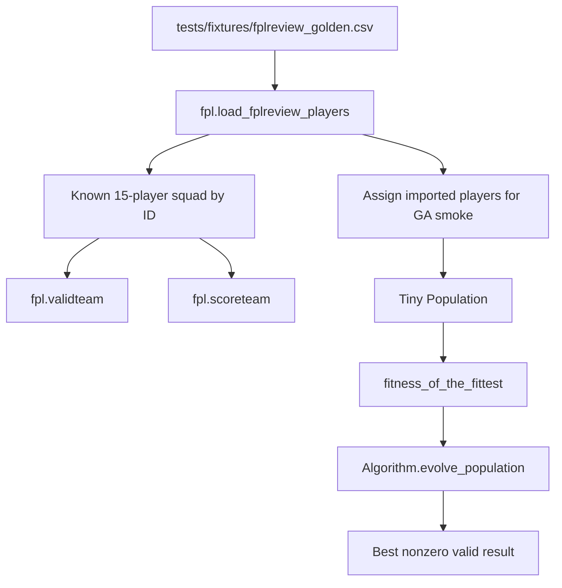

# feat: Add Golden fplreview Fixture Validation

## Summary

Add a synthetic golden fplreview fixture and end-to-end characterization tests that prove FPLgen can still import projection data, validate and score a known legal squad, and run a tiny seeded GA evolution path. Keep the work focused on safety-check validation, with only small testability seams allowed.

## Outcome

Implemented in PR https://github.com/markbarrington/fplgen/pull/4. The shipped fixture and tests cover import, balanced player-pool validation, known legal squad scoring, and a tiny seeded GA evolution smoke path. Verification command: `python3 -m unittest discover -s tests`.

---

## Problem Frame

FPLgen is an older Python codebase that recently moved to a single fplreview.com-style CSV input. The existing `tests/fixtures/fplreview_minimal.csv` fixture proves a few importer mappings, but it is too small to prove that the repo still completes an import-to-result loop. The safety check needs to help a future developer return to the repo and quickly answer whether the current optimizer path still basically works.

The origin requirements explicitly keep this separate from a full configurable GA runner, real-world historical fixtures, and optimizer behavior changes. This plan therefore treats the work as characterization-first: create stable validation data and prove current behavior before changing the algorithm.

---

## Requirements

**Fixture contract**

- R1. Add a committed synthetic fplreview-style CSV fixture under `tests/fixtures/` with enough players to support at least one valid 15-player squad.
- R2. Preserve the current importer column shape: `Pos`, `ID`, `Name`, `BV`, `SV`, `Team`, and the configured gameweek point columns required by `gameweek` and `forecastweeks`.
- R3. Include at least 2 goalkeepers, 5 defenders, 5 midfielders, and 3 forwards.
- R4. Design the known legal squad so it passes the current `validteam()` rules, including budget, duplicate-player checks, max-three-per-club, and the current per-position club-name uniqueness rule.
- R5. Include modest surplus players beyond the exact 15-player squad so random generation and mutation have alternatives.
- R6. Represent low-availability-style cases through low point values rather than imported unavailable status.

**Known-squad validation**

- R7. Add tests that import the golden fixture and construct a known legal 15-player squad by stable fixture identifiers.
- R8. Assert that the known squad passes `validteam()` and stays within budget.
- R9. Assert that the known squad scores above zero through `scoreteam()`.
- R10. Assert either an exact expected score or a narrow score condition strong enough to detect broken weekly projection wiring.

**GA smoke validation**

- R11. Add a deterministic smoke test that imports the golden fixture, creates a tiny population, evaluates fitness, evolves at least once, and confirms a nonzero fittest score.
- R12. Seed randomness explicitly so the GA smoke path is reproducible.
- R13. Avoid invoking the side-effect-heavy `code/GA.py` script path in tests; add only minimal production helpers or parameters if direct testing through existing `Population` and `Algorithm` classes is not sufficient.
- R14. Verify that the fittest individual returned by the smoke path remains compatible with `validteam()` and `scoreteam()`, while tolerating invalid individuals inside the evolved population.

**Documentation**

- R15. Update `README.md` with a concise safety-check command.
- R16. Document that the golden fixture is synthetic validation data, not a real projection-quality sample.
- R17. Leave real-export validation as a future optional check.

---

## Key Technical Decisions

- **Synthetic golden fixture first:** Build a hand-authored fixture rather than committing a sanitized real export. This keeps the safety check stable and avoids live-data, licensing, or projection-model drift (see origin: `docs/brainstorms/2026-06-02-golden-fplreview-fixture-requirements.md`).
- **Characterization before behavior change:** Tests should prove current import, validation, scoring, generation, and evolution behavior before changing those paths. If a current behavior is surprising but not directly blocking the safety check, record it rather than fixing it in this plan.
- **Direct GA component smoke over full runner invocation:** The test should exercise `Population` and `Algorithm` directly instead of importing `code/GA.py`, because `code/GA.py` loads runtime data, creates 10,000 individuals, and can loop up to 300 generations at import-time script scale.
- **Minimal testability seams only:** Prefer test helpers and direct class usage. Add production helpers only if direct usage forces brittle test setup or hides the behavior being validated.
- **Seed the shared randomness path:** The smoke test should seed the Python random module before population generation and evolution so `fpl.generateteam()`, `fpl.getrandomplayer()`, and `Algorithm` selection/mutation become reproducible enough for a safety check.

---

## High-Level Technical Design

The work creates one committed fixture that feeds two validation paths: a stable known-squad path and a tiny GA path. Both paths validate the current code, but they answer different questions.

---

## Implementation Units

### U1. Create the Golden Fixture Corpus

- **Goal:** Add a synthetic fplreview-format CSV that is large enough and balanced enough for both known-squad scoring and tiny random GA generation.
- **Requirements:** R1-R6
- **Dependencies:** None
- **Files:**
  - `tests/fixtures/fplreview_golden.csv`
  - `tests/test_fplreview_golden.py`
- **Approach:** Start with a compact but surplus fixture, likely in the 20-30 player range. Include the exact fplreview-style fields the importer already accepts and six configured point columns matching the current hard-coded horizon. Keep player IDs, names, teams, positions, and prices intentionally simple and stable. Ensure the planned known squad uses unique players, fits under budget, has exact squad counts, and avoids duplicate `team_name` values within each position because current `validteam()` rejects those.
- **Execution note:** Build this test-first as characterization data: the fixture should satisfy the current code rather than implying new scoring or validity behavior.
- **Patterns to follow:** Use the column shape from `tests/fixtures/fplreview_minimal.csv` and the importer assertions in `tests/test_fplreview_import.py`.
- **Test scenarios:**
  - Importing `tests/fixtures/fplreview_golden.csv` returns more than 15 mapped players with all four `element_type` values represented.
  - The imported fixture has at least the required positional counts for a 15-player squad.
  - At least one low-projection player imports with `status == "a"` and low weekly score values, confirming low availability-style cases are represented through points rather than status.
  - Missing-column and mapping validation remain covered by the existing minimal fixture tests; do not duplicate all importer failure cases here.
- **Verification:** The fixture imports through `fpl.load_fplreview_players()` without special parsing, and the new test file can identify enough fixture rows to build the known legal squad used by later units.

### U2. Add Known-Squad End-to-End Scoring Tests

- **Goal:** Prove that imported golden fixture players can form a known legal squad and reach scoring with a stable nonzero result.
- **Requirements:** R1-R10
- **Dependencies:** U1
- **Files:**
  - `tests/test_fplreview_golden.py`
- **Approach:** Build the known squad by player ID or exact name from imported fixture rows, then append a deterministic transfer pattern and chip list compatible with `scoreteam()`. Keep transfers inactive or harmless enough that the test focuses on import, validity, lineup selection, and scoring. Assert `fpl.teamvalue()` is at or below budget, `fpl.validteam()` is true, and `fpl.scoreteam()` returns the expected score or a deliberately narrow score condition derived from the fixture.
- **Execution note:** Treat the final expected score as characterization. If computing the exact total reveals surprising current behavior, preserve it in the assertion and note any follow-up outside this plan rather than changing scoring rules here.
- **Patterns to follow:** Existing `validteam()` smoke tests in `tests/test_fpl_smoke.py`; imported-player mapping tests in `tests/test_fplreview_import.py`.
- **Test scenarios:**
  - Covers AE1. Given the golden fixture, selecting the known squad yields exactly 15 players with the required positional counts.
  - Covers AE1. The known squad passes `fpl.validteam()` and stays within `budget`.
  - Covers AE1 and AE2. The known squad produces a nonzero score through `fpl.scoreteam()` using imported weekly point fields.
  - Covers AE2. Changing or misaligning the fixture's weekly point values would make the expected-score assertion fail.
- **Verification:** A developer can run the test suite and see a stable scoring characterization that proves fplreview-style import reaches current scoring logic.

### U3. Add Tiny Seeded GA Smoke Validation

- **Goal:** Prove the random team generation, fitness evaluation, and evolution path still connects against the golden fixture without running the full `code/GA.py` script.
- **Requirements:** R1-R6, R11-R14
- **Dependencies:** U1
- **Files:**
  - `tests/test_fplreview_golden.py`
  - `code/GA.py` only if a minimal helper is truly needed
  - `code/Population.py` only if a direct compatibility issue is exposed
  - `code/Algorithm.py` only if a direct compatibility issue is exposed
- **Approach:** In the test, import golden fixture players and assign them to the same global player state that `Population` and `Individual` currently rely on. Seed randomness before constructing a small `Population`, evaluate the fittest score, evolve at least once with `Algorithm.evolve_population()`, then evaluate the new fittest score. Keep the population size small enough for fast tests but large enough to reduce seed fragility. Avoid assertions about optimizer improvement; this is a connectivity smoke test, not a performance benchmark.
- **Execution note:** Begin by testing through existing `Population` and `Algorithm` classes directly. Add a small production helper only if the direct path requires duplicating too much script behavior or cannot avoid `code/GA.py`'s full run loop.
- **Patterns to follow:** Current `Population.fitness_of_the_fittest()` and `Algorithm.evolve_population()` usage in `code/GA.py`, but with tiny test-sized parameters.
- **Test scenarios:**
  - Covers AE3. With the golden fixture loaded and randomness seeded, a tiny population can be constructed without index errors or empty-player failures.
  - Covers AE3. Calling `fitness_of_the_fittest()` on the tiny population returns a nonzero score.
  - Covers AE3. Evolving the tiny population once returns another population of the same size and its fittest score remains nonzero.
  - Covers R14. The evolved fittest individual's first 15 genes are still accepted by `validteam()` and can be passed to `scoreteam()`.
  - The test does not import or execute `code/GA.py`'s production-sized script loop.
- **Verification:** The test suite proves that the GA component path remains callable against committed fplreview-style data with deterministic setup.

### U4. Document the Safety Check

- **Goal:** Make the golden-fixture validation easy for a future developer to discover and run.
- **Requirements:** R15-R17
- **Dependencies:** U1, U2, U3
- **Files:**
  - `README.md`
- **Approach:** Add a short note in the Development section naming the golden fixture safety check and the normal test command that exercises it. Keep the wording clear that this fixture is synthetic and validates repo functionality, not projection quality or real-season accuracy. Mention that real-export validation remains future/optional.
- **Patterns to follow:** Existing concise README development commands and data-file explanation.
- **Test scenarios:**
  - Test expectation: none -- README text changes are verified by review, and the behavioral coverage lives in U1-U3.
- **Verification:** A reader returning to the repo can identify the command to run and understand what confidence the golden fixture does and does not provide.

---

## Acceptance Examples

- AE1. Given the committed golden fixture, when the known squad test imports and selects its expected 15 players, then `validteam()` returns true and `scoreteam()` returns a nonzero score.
- AE2. Given a future importer change drops or misaligns weekly projection fields, when the known squad score test runs, then the expected score or score condition fails.
- AE3. Given the committed golden fixture and a fixed random seed, when the tiny GA smoke test runs, then it creates a small population, evolves at least once, and reports a nonzero fittest score without invoking the full `code/GA.py` script loop.
- AE4. Given a developer returns to the repo later, when they read `README.md`, then they can identify the safety-check command and understand that the golden fixture is synthetic validation data.

---

## Scope Boundaries

### In Scope

- A committed synthetic fplreview-style fixture.
- Known legal squad validation and scoring characterization.
- Tiny seeded GA smoke validation.
- Small test helpers or narrow production seams if required for testability.
- README safety-check guidance.

### Deferred to Follow-Up Work

- Refactoring `code/GA.py` into a configurable CLI runner.
- Adding real fplreview export validation or historical fixtures from fplcache/theFPLkiwi.
- Repairing invalid evolved individuals or changing mutation/crossover strategy.
- Broader scoring, transfer, chip, or validity-rule changes.
- Changing the current hard-coded gameweek and forecast-week configuration.

---

## Risks and Dependencies

- **Random-generation fragility:** A tiny population can become seed-sensitive if the fixture has too little surplus. Mitigate by giving each position enough alternatives and choosing a stable seed after the fixture is in place.
- **Current validity rules are stricter than expected FPL rules:** `validteam()` rejects duplicate `team_name` values within a position. Treat this as current behavior for this plan and design the known squad around it.
- **GA evolution can create invalid individuals:** The smoke test should tolerate invalid individuals inside the population while requiring the fittest checked result to remain scoreable and nonzero.
- **Scoreteam mutates player state:** Tests should reset imported/global state between cases and avoid relying on `picked` flags after scoring.
- **Average fitness can include unevaluated scores:** Do not use `Population.get_average_fitness()` as the primary smoke assertion unless the test first forces each individual's fitness to be evaluated.

---

## Sources and Research

- Origin requirements: `docs/brainstorms/2026-06-02-golden-fplreview-fixture-requirements.md`
- Prior import requirements: `docs/brainstorms/2026-06-02-fplreview-import-requirements.md`
- Current importer and scoring code: `code/fpl.py`
- Current script runner: `code/GA.py`
- Current GA components: `code/Population.py`, `code/Individual.py`, `code/Algorithm.py`
- Existing tests and fixtures: `tests/test_fplreview_import.py`, `tests/test_fpl_smoke.py`, `tests/fixtures/fplreview_minimal.csv`
