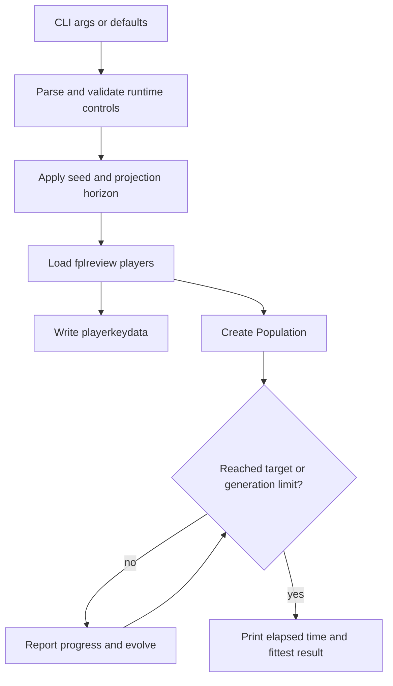

# feat: Add Configurable GA Runner

## Summary

Add a testable command-line runner for FPLgen that preserves today's no-flag GA behavior while allowing short deterministic runs through explicit runtime options.

---

## Problem Frame

FPLgen has moved to a single fplreview.com-style CSV input and now has a synthetic golden fixture that proves the current import-to-GA path can work. The remaining friction is that routine run controls still require source edits. `code/GA.py` runs immediately at import time, always loads the default runtime CSV, creates a production-sized population, and stops only after the current hard-coded generation limit or max-fitness target.

The plan is to make the runner callable and configurable without changing FPL scoring, transfer behavior, mutation, crossover, or broader state architecture. This is a narrow control-surface improvement that sets up later `RunConfig` and `FplContext` work without doing that larger refactor now.

---

## Requirements

**CLI controls**

- R1. Running `python3 code/GA.py` with no flags preserves the current default input path, population size, generation limit, gameweek, and forecast horizon.
- R2. The runner accepts an input CSV path for fplreview-style exports outside `data/fplreview.csv`.
- R3. The runner accepts population-size and generation-limit options for bounded runs.
- R4. The runner accepts a random seed option that makes the random GA path reproducible for the same input and settings.
- R5. The runner accepts gameweek and forecast-window options that affect the fplreview projection columns loaded for the run.

**Run behavior**

- R6. The runner reports import, population creation, generation progress, elapsed time, and final fittest output.
- R7. The generation loop stops when either the max-fitness target is reached or the configured generation limit is reached.
- R8. Invalid runtime options fail before import, population creation, or evolution begins.
- R9. Missing projection columns for the selected gameweek and forecast window fail before optimizer work begins.

**Compatibility and verification**

- R10. Existing GA, scoring, import, transfer, and inspection-output behavior remain unchanged except where needed to respect runtime controls.
- R11. Tests cover argument parsing, invalid controls, custom input loading, and a tiny deterministic runner path.
- R12. README guidance shows both the default run and a short seeded run.

---

## Key Technical Decisions

- **Callable runner before script entrypoint:** Move the executable behavior behind a callable runner function, then have the script entrypoint delegate to it. This prevents tests from importing a production-sized run and gives later workflow work a stable seam to reuse.
- **Compatibility defaults stay in the runner:** Keep today's values as explicit defaults in the runner contract: default fplreview input, population size `10000`, generation limit `300`, current gameweek, current forecast horizon, and max-fitness target `10000`.
- **Path-taking import for custom inputs:** Use the existing fplreview path-taking importer for custom input paths and preserve generated `playerkeydata` inspection output after loading. The default path can continue to behave like current runtime loading as long as the same side effects are preserved.
- **Narrow global bridge for gameweek and forecast:** Apply gameweek and forecast options to the existing module-level settings before importing players. This is intentionally a bridge over current global state, not a new configuration architecture.
- **No new dependencies:** Use Python standard-library argument parsing and random seeding. The project currently has no runtime dependencies, and this feature does not need to add one.

---

## High-Level Technical Design

The important boundary is between parsing and running. Parsing produces validated runtime controls; running applies those controls to the existing FPLgen components in the same order the script currently uses.

---

## Implementation Units

### U1. Extract a Callable Runner

- **Goal:** Turn the current script behavior into a callable execution path while preserving the default run.
- **Requirements:** R1, R6, R7, R10
- **Dependencies:** None
- **Files:**
  - `code/GA.py`
  - `tests/test_ga_runner.py`
- **Approach:** Create a runner function that performs the current sequence: import player data, start timing, set max fitness, create the population, loop through generations, report progress, and output the fittest individual. Keep the `if __name__ == "__main__"` path as the script entrypoint so importing `code/GA.py` in tests does not start a full run.
- **Execution note:** Add characterization-style tests before changing the runner shape enough to risk import-time side effects.
- **Patterns to follow:** Existing `code/GA.py` ordering; direct `Population` and `Algorithm` usage in `tests/test_fplreview_golden.py`.
- **Test scenarios:**
  - Importing the runner module does not import player data, create a population, or print progress.
  - Calling the runner with explicit tiny settings creates a population and returns or exposes a final fittest score above zero.
  - Covers AE2. A tiny runner call against the golden fixture completes without using the production-sized default population or generation limit.
- **Verification:** The old script entrypoint still runs through the same high-level stages, and tests can exercise runner behavior without triggering a production-sized search.

### U2. Add CLI Parsing and Runtime Validation

- **Goal:** Add command-line controls for input path, population size, generation limit, seed, gameweek, and forecast window.
- **Requirements:** R1-R5, R8
- **Dependencies:** U1
- **Files:**
  - `code/GA.py`
  - `tests/test_ga_runner.py`
- **Approach:** Add a small argument parser with compatibility defaults. Validate numeric options early: population size and generation limit should be positive enough to run safely, and gameweek / forecast window should be positive integers. Treat invalid options as parser-level or pre-run failures so no data import or evolution has started.
- **Patterns to follow:** Standard-library-only project style in `pyproject.toml`; path handling style from `code/paths.py`.
- **Test scenarios:**
  - Parsing no arguments returns defaults matching current script behavior.
  - Parsing custom input, population, generation limit, seed, gameweek, and forecast window returns those values.
  - Covers AE5. Invalid population size fails before import or evolution.
  - Covers AE5. Invalid generation limit fails before import or evolution.
  - Invalid gameweek or forecast window fails before import or evolution.
- **Verification:** A developer can inspect parser defaults and see no behavior drift for the no-flag run, while invalid controls fail before optimizer work.

### U3. Wire Custom Input and Projection Horizon Controls

- **Goal:** Make runner controls affect the imported fplreview data without introducing a full run-state architecture.
- **Requirements:** R2, R5, R9, R10
- **Dependencies:** U1, U2
- **Files:**
  - `code/GA.py`
  - `code/fpl.py`
  - `tests/test_ga_runner.py`
  - `tests/test_fplreview_import.py`
- **Approach:** Add or reuse a loading path that accepts an explicit fplreview CSV path, assigns the loaded players to the existing global player list, clears fixtures, and writes `playerkeydata`. Apply gameweek and forecast-window overrides before loading so `fplreview_gameweek_columns()` validates the correct projection columns. Keep existing `getplayerdata()` compatible for the default runtime path.
- **Patterns to follow:** `fpl.load_fplreview_players()` and `fpl.write_playerkeydata()` in `code/fpl.py`; temporary data-file patching pattern in `tests/test_fplreview_import.py`.
- **Test scenarios:**
  - A runner call with a custom golden fixture path loads that file rather than `data/fplreview.csv`.
  - A runner call with custom gameweek and forecast window loads the matching projection columns when they exist.
  - Covers AE4. A runner call with a projection horizon requiring missing columns fails before population creation.
  - The default loading path still writes `playerkeydata`.
- **Verification:** The runner can operate against committed fixtures and selected projection horizons while current importer behavior remains intact.

### U4. Add Seeded Deterministic Runner Coverage

- **Goal:** Prove the runner can execute short reproducible GA jobs for development comparison.
- **Requirements:** R4, R6, R7, R11
- **Dependencies:** U1, U2, U3
- **Files:**
  - `tests/test_ga_runner.py`
  - `tests/fixtures/fplreview_golden.csv`
- **Approach:** Use the golden fixture with a tiny population, a short generation limit, and a fixed seed. Capture stdout where needed so progress logging does not make tests noisy. Assert completion and reproducible final behavior for two identical short runs. Do not assert optimizer improvement; this is a reproducibility and wiring test.
- **Patterns to follow:** Random-state preservation and stdout capture in `tests/test_fplreview_golden.py`.
- **Test scenarios:**
  - Covers AE3. Two runner executions with the same fixture, seed, population, generation limit, gameweek, and forecast window produce the same final fittest score.
  - Covers AE2. A short seeded runner path reports a nonzero fittest score.
  - The generation loop stops at the configured generation limit when the max-fitness target is not reached.
- **Verification:** The test suite proves the CLI runner supports repeatable short jobs without relying on production defaults.

### U5. Update README Runtime Guidance

- **Goal:** Document the new runner controls without making the project look more packaged than it is.
- **Requirements:** R12
- **Dependencies:** U1-U4
- **Files:**
  - `README.md`
- **Approach:** Keep the quick start as `python3 code/GA.py`. Add an example short seeded run using the golden fixture or a custom fplreview export path, and briefly explain the flags in user-facing terms. Avoid introducing a console-script command until packaging work is explicitly in scope.
- **Patterns to follow:** Existing concise README sections for data files and development safety checks.
- **Test scenarios:** Test expectation: none -- README changes are verified by review, and behavioral coverage lives in `tests/test_ga_runner.py`.
- **Verification:** A reader can identify both the default run and a small deterministic development command from the README.

---

## Scope Boundaries

### In Scope

- CLI controls for input path, population size, generation limit, seed, gameweek, and forecast window.
- A callable runner seam that avoids import-time execution.
- Tiny deterministic runner tests against the committed golden fixture.
- README examples for default and short seeded runs.

### Deferred to Follow-Up Work

- Config files, scenario files, named presets, and CLI-over-config overrides.
- A typed `RunConfig` object and broader `FplContext` state model.
- Historical real-data fixtures from theFPLkiwi or fplcache.
- Packaging a console script such as `fplgen`.
- Validity repair, mutation/crossover tuning, or optimizer-quality measurement.

### Out of Scope

- Scoring, transfer, chip, or squad-validity rule changes.
- Replacing the genetic algorithm with another optimizer.

---

## Risks & Dependencies

- **Global state bridge:** Gameweek and forecast overrides currently need to update module-level values before import. Tests should restore those values after each run so state does not leak between cases.
- **Short-run reproducibility:** GA behavior uses Python's shared random module. Runner tests should preserve and restore random state around seeded runs.
- **Progress output coupling:** `Algorithm.evolve_population()` and `fpl.scoreteam()` print through existing paths. Tests should capture output rather than requiring this task to redesign logging.
- **Default run cost:** The no-flag behavior intentionally remains production-sized, so automated tests must always pass explicit tiny settings.

---

## Sources & Research

- Origin requirements: `docs/brainstorms/2026-06-03-configurable-ga-runner-requirements.md`
- Prior ideation: `docs/ideation/2026-06-02-repo-improvements-ideation.md`
- Prior configuration ideation: `docs/ideation/2026-06-02-hardcoded-elements-config-ideation.md`
- Current script runner: `code/GA.py`
- Current importer and global run settings: `code/fpl.py`
- Current path helper: `code/paths.py`
- Current GA components: `code/Population.py`, `code/Algorithm.py`, `code/FitnessCalc.py`
- Existing golden fixture tests: `tests/test_fplreview_golden.py`
- Existing fplreview import tests: `tests/test_fplreview_import.py`
