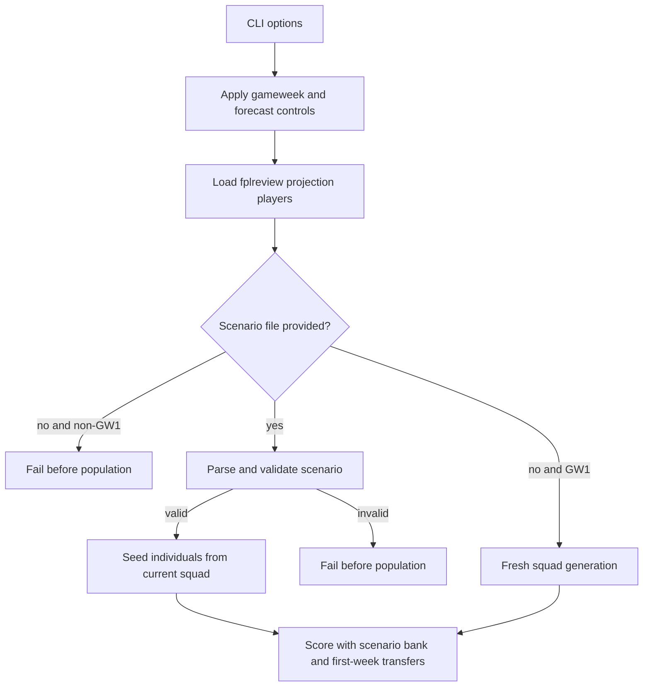

# feat: Add Existing Squad Scenario Support

## Summary

Add situation-only JSON scenarios so non-GW1 FPLgen runs start from a supplied gameweek, current squad, bank, and saved free transfers instead of generating a new first-week team. Preserve GW1 fresh-squad behavior, keep runtime controls in the CLI, and add a deterministic scenario generator plus editable template for tests and demos.

---

## Problem Frame

FPLgen now imports fplreview-style projections and has a configurable runner, but its optimizer still assumes the first forecast week begins with a newly generated squad. That is correct for GW1 and roughly compatible with a wildcard rebuild, but it is wrong for normal mid-season planning.

The implementation should add the smallest durable scenario contract needed for existing-squad runs. It should bridge into the current global-state-heavy code without requiring a full `RunConfig` or `FplContext` rewrite.

---

## Requirements

**Scenario Input and Validation**

- R1. The runner accepts an optional JSON scenario file describing FPL situation state only. Covers origin R1-R3.
- R2. GW1 runs can still run without a scenario file and use fresh-squad generation. Covers origin R4, F1, AE1.
- R3. Non-GW1 runs fail before optimizer work when no scenario file is supplied. Covers origin R5, AE2.
- R4. Non-GW1 scenarios supply gameweek, exactly 15 current squad FPL IDs, decimal bank, and saved free transfers. Covers origin R6-R8.
- R5. Scenario validation rejects missing or CLI-mismatched gameweek, duplicate IDs, missing projection IDs, invalid squad structure, more than 3 players from one club, malformed bank values, and malformed saved-free-transfer values. Covers origin R9-R16, F3, AE3-AE6.
- R6. Validation errors identify the scenario problem before population creation, scoring, or transfer evaluation. Covers origin R16, R31.

**Optimizer Behavior**

- R7. Non-GW1 initial individuals start from the supplied current squad rather than a randomly generated squad. Covers origin R17, F2, AE7.
- R8. Non-GW1 scoring may apply transfers in the first forecast week. Covers origin R18, R20, AE8.
- R9. Non-GW1 transfer affordability starts from scenario bank rather than derived fresh-squad budget remainder. Covers origin R19, AE7.
- R10. Existing Wildcard, Bench Boost, Triple Captain, and All Out Attack behavior is preserved except for narrow compatibility needed by existing-squad runs. Covers origin R21-R23, AE9.

**Scenario Generator, Template, and Output**

- R11. A developer/test utility generates repeatable valid JSON scenarios from a projection CSV. Covers origin R24-R28, F4, AE10.
- R12. The repo includes an editable JSON scenario template outside ignored runtime data. Covers user confirmation after brainstorm.
- R13. Generated scenarios and templates are clearly framed as test/demo aids, not live manager-team sync. Covers origin R26 and Scope Boundaries.
- R14. Non-GW1 run output identifies that the optimizer started from an existing squad and reports gameweek, bank, saved free transfers, and scenario source. Covers origin R29-R30.

---

## Key Technical Decisions

- **JSON for v1:** Use JSON for scenario files so Python 3.9 support remains dependency-free. TOML is more pleasant by hand, but it would require a new dependency or a Python version raise.
- **Editable template in `examples/`:** Add a committed template under `examples/` rather than `data/`, because `data/*` is intentionally ignored for local runtime inputs.
- **Gameweek consistency check:** Keep `--gameweek` as the runtime control, but require scenario JSON to include `gameweek` and reject the run if the scenario gameweek does not match the configured CLI gameweek. This preserves one runtime source of truth while catching stale or misapplied scenario files.
- **Scenario module as the boundary:** Put parsing, money conversion, ID lookup, validation, and scenario-team construction behind a focused module so the runner and optimizer do not accumulate ad hoc JSON handling.
- **Narrow global bridge:** Apply scenario values to the existing global-style optimizer path only where needed: starting squad, starting bank, transfer count, and first-week transfer eligibility. Do not attempt the larger `FplContext` refactor in this feature.
- **Fresh-team compatibility first:** Keep no-scenario GW1 behavior and current CLI defaults intact. Existing runner tests should continue to cover the default path.
- **Generator quality target is validity, not optimizer strength:** The scenario generator only needs to produce a legal, repeatable squad suitable for testing. It should not claim to model a real manager team or find an optimal starting squad.

---

## High-Level Technical Design

The plan keeps scenario handling at the runner boundary. Projection loading still happens first because validation needs the loaded player pool for ID, position, club, and price data.

---

## Implementation Units

### U1. Scenario Parser and Validator

- **Goal:** Add a focused scenario module that can parse JSON, convert decimal bank values to internal tenths, resolve current squad IDs against loaded players, and validate the supplied FPL situation.
- **Requirements:** R1, R4-R6
- **Dependencies:** None
- **Files:**
  - `code/scenario.py`
  - `tests/test_scenario.py`
  - `tests/fixtures/fplreview_golden.csv`
- **Approach:** Introduce a small data holder or plain dictionary contract for validated scenarios. Keep file parsing and validation pure enough for tests to call directly after loading fixture players and the configured gameweek. Validation should produce explicit `ValueError` messages for missing required fields, malformed JSON, missing or mismatched gameweek, wrong squad length, duplicate IDs, missing player IDs, bad position counts, club-limit failures, invalid bank, and invalid saved free transfers. Scenario squad validation enforces FPL squad shape and max-per-club rules without applying the fresh-team `teamvalue <= budget` rule, because an owned squad can be valid even when its current buy value exceeds the original starting budget.
- **Execution note:** Implement validation test-first because this module becomes the safety gate for all later optimizer behavior.
- **Patterns to follow:** Existing importer validation style in `fpl.map_fplreview_rows()` and test assertions in `tests/test_fplreview_import.py`.
- **Test scenarios:**
  - Covers AE3. A valid golden-fixture scenario with 15 known legal IDs, decimal bank, and saved free transfers validates and resolves to player dictionaries.
  - Covers AE4. A scenario with duplicate IDs fails before returning a validated scenario.
  - Covers AE5. A scenario with an ID absent from the loaded projection players fails with a missing-ID reason.
  - Covers AE6. Scenarios with wrong position counts or too many players from one club fail with squad-rule reasons.
  - A scenario whose `gameweek` does not match the configured runner gameweek fails before returning a validated scenario.
  - Covers malformed-value validation. Non-numeric bank, negative bank, non-integer saved free transfers, and out-of-range saved free transfers fail validation.
  - Malformed JSON and missing required fields fail with scenario-specific messages.
- **Verification:** Scenario validation can be exercised without creating a `Population` or calling `GA.run()`.

### U2. Runner Scenario Input Wiring

- **Goal:** Add a runner and CLI path for optional scenario files, enforce the GW1 vs non-GW1 requirement, and surface starting-state context in run output.
- **Requirements:** R1-R4, R6, R14
- **Dependencies:** U1
- **Files:**
  - `code/GA.py`
  - `tests/test_ga_runner.py`
  - `README.md`
- **Approach:** Add an optional scenario path parameter to parsing and `run()`. Load projections first, then validate the scenario against the loaded players and the configured CLI gameweek. If `gameweek` is 1 and no scenario is provided, preserve the current fresh-squad path. If `gameweek` is greater than 1 and no scenario is provided, fail before `Population` is created. When a scenario is used, print a concise run-context line with gameweek, bank, saved free transfers, and scenario source.
- **Patterns to follow:** Existing CLI controls and runner tests in `code/GA.py` and `tests/test_ga_runner.py`.
- **Test scenarios:**
  - Covers AE1. A GW1 run without a scenario still creates a population and produces a score against the golden fixture.
  - Covers AE2. A non-GW1 run without a scenario fails before population creation.
  - Covers R1. Parsing accepts an optional scenario path without changing existing defaults.
  - Covers R6 and R14. A non-GW1 run with a valid scenario prints existing-squad context before population creation.
  - A non-GW1 run with a scenario whose `gameweek` mismatches `--gameweek` fails before population creation.
  - A non-GW1 run with an invalid scenario fails before population creation and does not write misleading optimizer progress.
- **Verification:** Existing no-scenario runner tests remain meaningful, and new scenario runner tests prove the gate fires before optimization.

### U3. Existing-Squad Population Initialization

- **Goal:** Let non-GW1 populations seed every individual from the validated current squad while preserving transfer candidate, transfer pattern, and chip genes.
- **Requirements:** R7, R10
- **Dependencies:** U1, U2
- **Files:**
  - `code/Individual.py`
  - `code/Population.py`
  - `code/fpl.py`
  - `tests/test_existing_squad_optimizer.py`
- **Approach:** Add a narrow initialization path that passes the validated current squad and saved free transfers into individual creation. Existing random fresh-team creation remains the default. For scenario-backed individuals, the first 15 genes should be the supplied current squad while the rest of the genome remains compatible with current transfer and chip behavior. Scenario-backed transfer-pattern generation must allow the first slot to range from 0 through the supplied saved free transfers, while fresh-team generation keeps the current first-week zero-transfer behavior.
- **Patterns to follow:** Current `Individual` and `Population` construction flow, plus known-squad helper patterns from `tests/test_fplreview_golden.py`.
- **Test scenarios:**
  - Covers AE7. In a non-GW1 scenario population, every initial individual has the supplied 15 current squad IDs in the first 15 genes.
  - Scenario-backed individuals can generate first-week transfer counts up to the supplied saved free transfer count.
  - Fresh-team population creation without a scenario still produces varied generated squads.
  - Crossover and mutation still operate on scenario-backed individuals without changing genome length or chip slot placement.
  - Existing chip gene generation remains unchanged for Wildcard, Bench Boost, Triple Captain, and All Out Attack.
- **Verification:** Population tests can inspect genes directly before scoring, proving scenario seeding independently from transfer scoring.

### U4. Scenario Bank and First-Week Transfer Semantics

- **Goal:** Score non-GW1 scenario-backed teams using scenario bank and allowing transfers in the first forecast week.
- **Requirements:** R8-R10
- **Dependencies:** U3
- **Files:**
  - `code/fpl.py`
  - `tests/test_existing_squad_optimizer.py`
  - `tests/test_fplreview_golden.py`
- **Approach:** Extend scoring inputs so `scoreteam()` can distinguish fresh-squad scoring from scenario-backed scoring. Fresh-squad scoring keeps derived bank, the current fresh-team budget validation, and first-week transfer skip. Scenario scoring uses the scenario squad validation path from U1, starts from scenario bank, and may apply transfer pattern entries in week 1. Keep the existing chip code path unless the supplied starting squad exposes a direct compatibility bug.
- **Execution note:** Add characterization tests around current fresh-squad scoring before changing first-week transfer behavior.
- **Patterns to follow:** Current `scoreteam()` transfer loop and transfer affordability checks in `fpl.transfer()`.
- **Test scenarios:**
  - Covers AE7. A scenario-backed score uses the supplied decimal bank converted to internal tenths rather than `budget - teamvalue(team)`.
  - Covers AE8. A scenario-backed team can apply transfers in forecast week 1 when the transfer pattern calls for them.
  - A scenario-backed owned squad whose buy value exceeds the fresh starting budget can still score if its squad shape and scenario bank are valid.
  - A fresh generated team still skips transfers in forecast week 1.
  - Covers AE9. Existing chip behavior is not broadened or removed by this change.
  - Bank is updated after an accepted transfer using current sell-price and incoming-cost behavior.
- **Verification:** Tests prove the old and new first-week semantics coexist rather than replacing one another.

### U5. Scenario Generator Utility and Editable Template

- **Goal:** Add a deterministic utility for producing valid test/demo scenarios from projection input, plus a committed editable JSON template.
- **Requirements:** R11-R13
- **Dependencies:** U1
- **Files:**
  - `code/generate_scenario.py`
  - `examples/scenario_template.json`
  - `tests/test_generate_scenario.py`
  - `tests/fixtures/README.md`
  - `README.md`
- **Approach:** Build the generator around the same scenario validation rules from U1. It should select a legal 15-player squad from loaded projection players, accept deterministic controls such as seed or stable ordering, and emit JSON with gameweek, bank, saved free transfers, and current squad IDs. The generated gameweek should be supplied explicitly by the user or defaulted in the utility help text, then validated through the same CLI/scenario consistency rule when used by the runner. The template should be valid JSON and clearly editable, even though JSON cannot contain comments.
- **Patterns to follow:** CLI style from `code/GA.py` and fixture utility style from `tests/fixtures/convert_fplkiwi_fixture.py`.
- **Test scenarios:**
  - Covers AE10. Running the generator twice with the same fixture and deterministic controls produces identical scenario JSON.
  - Generated scenario JSON validates through the U1 validator.
  - The generator fails clearly when the projection input cannot produce a legal 15-player squad.
  - The committed template is valid JSON and contains the required situation fields.
- **Verification:** Generated scenarios can be used directly in runner tests without hand-editing fixture IDs.

### U6. Documentation and Fixture Integration

- **Goal:** Document the scenario workflow and make the test/demo distinction clear to future users and implementers.
- **Requirements:** R12-R14
- **Dependencies:** U2, U5
- **Files:**
  - `README.md`
  - `tests/fixtures/README.md`
  - `examples/scenario_template.json`
- **Approach:** Update README usage with one GW1 no-scenario example, one non-GW1 scenario example, and one scenario-generator example. Explain that scenario files contain FPL situation only, while run controls stay as CLI flags. Note that generated scenarios are test/demo aids and that real non-GW1 runs require the user's actual squad.
- **Patterns to follow:** Existing concise README sections for runtime options, data files, and development checks.
- **Test scenarios:** Test expectation: none -- documentation changes are verified by review, while template validity is covered in U5.
- **Verification:** A reader can understand when a scenario is required, how to start from the template, and how generated scenarios should and should not be used.

---

## Scope Boundaries

### Deferred to Follow-Up Work

- TOML scenario files or richer scenario-file ergonomics.
- Runtime controls in scenario files.
- Name-based or fuzzy current-squad matching.
- Live FPL team sync.
- Free Hit implementation.
- Removing All Out Attack.
- Broader chip model modernization.
- Locked-deadline scenarios.
- Full `RunConfig` or `FplContext` migration.

### Out of Scope

- Replacing the genetic algorithm.
- Changing fplreview projection import semantics.
- Optimizing generated test scenarios for quality.
- Claiming generated scenarios represent real manager squads.

---

## Risks and Dependencies

- **Global state leakage:** Scenario state will initially bridge through existing globals and class-level state. Tests should restore touched state after each run, following existing runner test patterns.
- **First-week transfer split:** Fresh-squad and existing-squad semantics intentionally differ for week 1. Tests must prove both paths, or future refactors may collapse them accidentally.
- **JSON hand-editing friction:** JSON is dependency-free but less friendly than TOML. The editable template and README examples are part of the usability surface, not polish.
- **Scenario generator interpretation:** A generated valid squad could be mistaken for a recommended team. Documentation and output should frame it as test/demo data only.

---

## Sources and Research

- Origin requirements: `docs/brainstorms/2026-06-03-existing-squad-scenario-requirements.md`
- Prior ideation: `docs/ideation/2026-06-02-repo-improvements-ideation.md`
- Configuration ideation: `docs/ideation/2026-06-02-hardcoded-elements-config-ideation.md`
- Current runner: `code/GA.py`
- Current initialization: `code/Individual.py`, `code/Population.py`
- Current squad generation, validation, bank, transfer, and scoring behavior: `code/fpl.py`
- Current runner tests: `tests/test_ga_runner.py`
- Existing known-squad fixture coverage: `tests/test_fplreview_golden.py`
- Existing importer validation coverage: `tests/test_fplreview_import.py`
