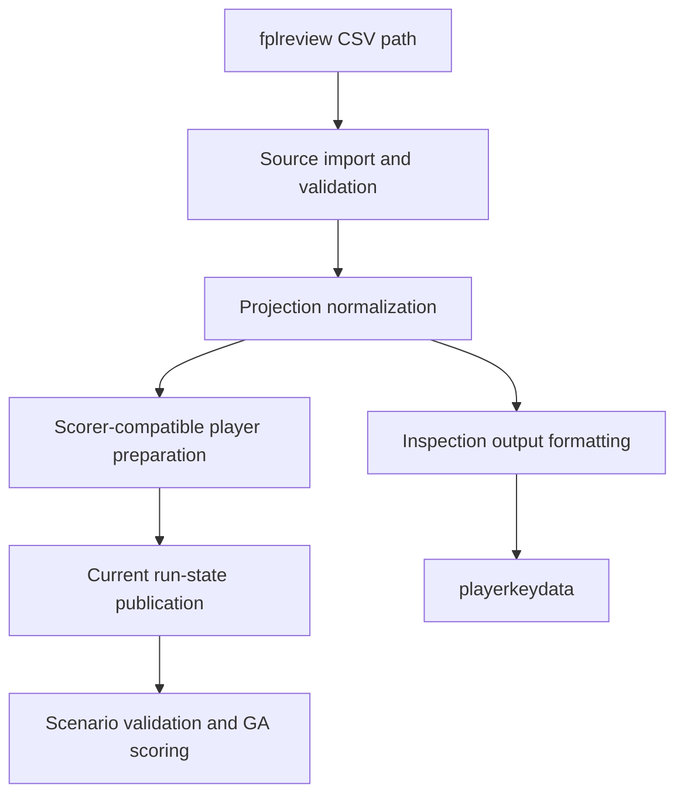

# refactor: Split Import Projection and Scoring Boundaries

## Summary

Refactor FPLgen's fplreview data path so source import, projection normalization, scorer-compatible player preparation, global run-state publication, and inspection output are clear stages. Preserve current optimizer behavior while creating a cleaner stepping stone toward future `RunConfig`, `FplContext`, and projection-source work.

---

## Problem Frame

The current fplreview path in `code/fpl.py` blends CSV validation, row mapping, projection summary derivation, global `players` assignment, and `playerkeydata` output. Scoring and scenario validation then depend on the resulting mutable player dictionaries and module globals.

The origin requirements call for a boundary-first, behavior-preserving refactor. This plan keeps the current player dictionary contract for the GA and scoring path, adds characterization around the handoff points, and extracts enough structure that future work can replace or extend stages without guessing which behavior belongs to import, projection, scoring, or inspection.

---

## Requirements

**Boundary behavior**

- R1. fplreview source reading and validation are separable from projection normalization, scorer preparation, global state publication, and inspection output. Origin: R1-R2.
- R2. Normalization preserves FPL ID, display name, team, position, buy value, sell value, weekly EVs, and derived projection summaries. Origin: R5-R8.
- R3. Scorer-compatible player dictionaries retain the current fields and semantics needed by squad generation, transfer affordability, scenario validation, chips, and scoring. Origin: R9-R12.
- R4. `playerkeydata` remains available after loading data and is generated from normalized projection values. Origin: R13-R15.

**Compatibility**

- R5. Existing GW1, non-GW1 scenario, known-squad scoring, historical fixture, and runner behaviors remain unchanged. Origin: R10-R17.
- R6. Source import remains path-driven so the runner, tests, and fixture utilities can load explicit fplreview CSV files. Origin: R3.
- R7. Import and validation failures still happen before scenario validation or optimizer population creation. Origin: R4, AE1.
- R8. fplreview EVs continue to flow into scoring without local projection adjustment. Origin: R7, AE3.
- R9. Small cleanup changes are limited to the touched data path and must be covered when they can affect scorer-visible behavior. Origin: R18.

**Documentation**

- R10. README changes are limited to clarifying the internal data path if the refactor makes the current wording stale. Origin: R19.

---

## Key Technical Decisions

- **Keep the scorer contract stable:** The GA, `Population`, `Individual`, scenario validation, and scoring should continue consuming player dictionaries in the current shape. This confines risk while still making the upstream data path clearer.
- **Introduce a fplreview-specific boundary module before migrating callers:** A focused module for the current fplreview CSV path gives tests a place to target without requiring a full `FplContext`. This is not a provider abstraction, registry, or generic projection-source framework.
- **Keep compatibility wrappers during the transition:** Existing public helpers such as the loader path used by tests and the runner should remain available, delegating to the new boundary stages where practical.
- **Characterization-first execution posture:** This is a legacy, global-state-heavy path. Add or tighten tests around current behavior before moving responsibilities.
- **Localize team-map mutation:** Normalization should avoid hidden global `teamid` mutation where practical by working from an explicit or copied team map. Compatibility wrappers can apply team-map additions when legacy behavior requires them.
- **Do not remove legacy fixture projection code in this pass:** The old fixture-based projection functions can stay unless implementation reveals a tiny, obviously safe cleanup. Removing them would broaden the refactor beyond the origin scope.

---

## High-Level Technical Design

The planned shape is a staged pipeline. The last stage still publishes the existing player dictionaries into the current run state so downstream optimizer behavior stays stable.

The boundary module should own stages B through D and G for the fplreview CSV path only. `code/fpl.py` may keep compatibility-facing wrappers and the current scoring functions while the implementation migrates internals behind those wrappers.

Directional boundary contract:

- Source import returns CSV rows plus field names from an explicit path.
- Projection normalization returns fplreview projection records with identity, team, position, prices, weekly EVs, and derived summary values.
- Scorer preparation converts normalized projection records into the current player dictionary shape.
- Inspection formatting produces `playerkeydata` lines from normalized projection values, or from prepared players only when they preserve the same projection values.

---

## Implementation Units

### U1. Characterize Current Data Handoff Behavior

- **Goal:** Add focused tests that lock down the current values crossing from fplreview import into scorer-visible player data and inspection output.
- **Requirements:** R1-R9
- **Dependencies:** None
- **Files:**
  - `tests/test_fplreview_import.py`
  - `tests/test_fplreview_golden.py`
  - `tests/test_ga_runner.py`
- **Approach:** Expand characterization around the existing import surface before moving code. Prefer assertions on observable values and failure order over assertions on internal helper names.
- **Execution note:** Start here so later extraction work has a behavior harness before responsibilities move.
- **Patterns to follow:** Existing fixture-based assertions in `tests/test_fplreview_import.py`; known-squad scoring in `tests/test_fplreview_golden.py`; pre-population failure checks in `tests/test_ga_runner.py`.
- **Test scenarios:**
  - Covers AE1. A missing configured gameweek column still fails before scenario validation or `Population` is created.
  - Covers AE2. A representative fplreview row maps into scorer-visible values for identity, team, position, prices, weekly EVs, lookahead points, this-week points, average projection, and total projection fields.
  - Covers AE3. The golden known-squad score remains unchanged.
  - Covers AE5. `playerkeydata` contains projection values for the configured forecast horizon.
- **Verification:** The added or tightened characterization tests fail against intentional changes to scorer-visible projection values or failure ordering.

### U2. Extract Source Import and Projection Normalization

- **Goal:** Separate CSV source reading, required-column validation, and projection normalization into a boundary that can be tested without invoking global run-state assignment or inspection output.
- **Requirements:** R1, R2, R6-R8
- **Dependencies:** U1
- **Files:**
  - `code/fpl.py`
  - `code/projections.py` (new)
  - `tests/test_fplreview_import.py`
  - `tests/test_fplkiwi_historical_fixture.py`
- **Approach:** Move fplreview-specific source and normalization responsibilities behind a focused module while preserving current helper behavior through compatibility wrappers. Keep the normalized data sufficient to derive the existing player fields without introducing new projection math, provider abstractions, or source registries.
- **Technical design:** Directional only: source import returns rows and fieldnames; normalization returns fplreview projection records; scorer preparation turns those records into current player dictionaries. Team mapping should receive an explicit or copied team map and surface any additions so compatibility wrappers can apply legacy global mutations intentionally.
- **Patterns to follow:** Current validation behavior in `fplreview_gameweek_columns`; price, position, and team mapping behavior currently asserted by importer and historical-fixture tests.
- **Test scenarios:**
  - Covers AE1. Missing required source columns and missing configured gameweek columns raise the same class of fast validation errors.
  - Covers AE2. Normalization preserves values from both the minimal fplreview fixture and the historical theFPLkiwi-derived fixture.
  - A blank or malformed CSV header still fails before scorer-compatible player data is produced.
  - Team names not already present in the team map continue to receive stable IDs within a load.
  - Repeated normalization tests with unknown teams do not leak unexpected `teamid` mutations or renumber teams across tests.
- **Verification:** Existing direct calls to the fplreview loader still work, and new normalization-level tests can run without writing `playerkeydata`.

### U3. Define Scorer-Compatible Player Preparation

- **Goal:** Make the conversion from normalized projections to existing scorer-compatible player dictionaries explicit.
- **Requirements:** R2, R3, R5, R8, R9
- **Dependencies:** U2
- **Files:**
  - `code/fpl.py`
  - `code/projections.py` (new)
  - `tests/test_fplreview_import.py`
  - `tests/test_fplreview_golden.py`
  - `tests/test_existing_squad_optimizer.py`
- **Approach:** Treat the current player dictionary shape as the v1 scoring adapter. Keep fields used by generation, transfers, scenarios, chips, and scoring intact, and document in tests which values are scorer-facing rather than source-facing.
- **Patterns to follow:** Existing player dictionary keys produced by `map_fplreview_player`; scenario ID resolution in `code/scenario.py`; known-squad helpers in `tests/test_fplreview_golden.py`.
- **Test scenarios:**
  - Covers AE2. Prepared players expose the current scorer fields for IDs, costs, status, team, position, and weekly projection keys.
  - Covers AE3. Known-squad scoring against the golden fixture remains `423.6`.
  - Covers AE4. A non-GW1 scenario resolves IDs against prepared players and scores with the existing scenario bank semantics.
  - A fresh GW1 population still generates varied squads from the prepared global player pool.
- **Verification:** GA and scoring tests pass without requiring downstream classes to learn a new player model.

### U4. Split Inspection Output From Load Side Effects

- **Goal:** Make `playerkeydata` generation consume normalized projection data as an output stage rather than being embedded in source import.
- **Requirements:** R1, R4, R9
- **Dependencies:** U2, U3
- **Files:**
  - `code/fpl.py`
  - `code/projections.py` (new)
  - `tests/test_fplreview_import.py`
  - `tests/test_ga_runner.py`
- **Approach:** Keep `playerkeydata` writing in the existing runtime flow, but route it through an inspection-output boundary based on normalized projection values. Prepared player dictionaries may be used only when they preserve the same projection values. Preserve the file content expectations already useful to tests while making it possible to load and normalize projections without writing files.
- **Patterns to follow:** Existing `write_playerkeydata` output format; temporary `data_file` patching in runner and import tests.
- **Test scenarios:**
  - Covers AE5. Loading player data through the compatibility runtime path writes `playerkeydata`.
  - Direct normalization or scorer-preparation tests can run without creating `playerkeydata`.
  - The written inspection output reflects the active forecast horizon after `--forecastweeks` changes.
  - Missing output directory handling continues to use the existing `data_file(..., for_write=True)` behavior.
- **Verification:** Runtime tests still observe `playerkeydata`, while lower-level boundary tests do not need filesystem output.

### U5. Rewire Runner and Scenario Integration Through the Boundary

- **Goal:** Ensure existing fplreview CSV loading call sites and loaded-player consumers use the boundary-backed path consistently.
- **Requirements:** R5-R7
- **Dependencies:** U2, U3, U4
- **Files:**
  - `code/GA.py`
  - `code/generate_scenario.py`
  - `code/fpl.py`
  - `tests/test_ga_runner.py`
  - `tests/test_generate_scenario.py`
  - `tests/test_existing_squad_optimizer.py`
- **Approach:** Preserve the existing runner order: apply runtime options, load players, require or validate scenario for non-GW1 runs, then create the population. Keep scenario validation against the loaded player pool, but do not refactor `code/scenario.py` internals unless implementation proves it is necessary to preserve behavior.
- **Patterns to follow:** Current `GA.run()` ordering; scenario generator loading pattern; pre-population failure assertions in `tests/test_ga_runner.py`.
- **Test scenarios:**
  - Covers AE1. A projection import failure still happens before scenario validation or population creation.
  - Covers AE4. A valid non-GW1 scenario still prints context and starts from the current squad.
  - A scenario gameweek mismatch still fails before population creation after projections are loaded.
  - Scenario generator output still validates against players loaded through the boundary-backed path.
- **Verification:** Existing runner and scenario test suite passes with no user-facing CLI changes.

### U6. Documentation and Cleanup Pass

- **Goal:** Update documentation only where needed and keep cleanup limited to the data path touched by the refactor.
- **Requirements:** R9, R10
- **Dependencies:** U1-U5
- **Files:**
  - `README.md`
  - `code/fpl.py`
  - `code/projections.py` (new)
  - `tests/test_fplreview_import.py`
- **Approach:** Revise docs only if the refactor changes how to describe the data path or `playerkeydata`. Remove duplicated helper logic only when tests cover the behavior and the cleanup does not broaden into scoring, chip, or transfer refactors.
- **Patterns to follow:** Current README's concise data-file explanation; existing test-first style for data-path changes.
- **Test scenarios:**
  - Covers AE6. Any cleanup touching scorer-visible fields has a focused regression assertion.
  - Test expectation for README-only edits: none -- documentation is verified by review.
- **Verification:** The final diff shows no broad scoring-rule, chip, transfer, solver, or context-object rewrite.

---

## Scope Boundaries

### Deferred to Follow-Up Work

- Full `RunConfig` or `FplContext` migration.
- Alternate projection sources beyond fplreview-style CSV.
- Projection ensembles, EV blending, uncertainty distributions, or source-disagreement reporting.
- Broad scoring-rule edge-case coverage unrelated to the boundary split.
- Optimizer-quality metrics, exact solver benchmarking, or invalid-individual repair.

### Out of Scope

- Changing squad recommendations as an intended outcome.
- Replacing the player dictionary contract across GA and scoring in v1.
- Live FPL API integration.
- fplcache official-state ingestion.
- Removing legacy fixture-based projection code unless implementation reveals a tiny, well-covered cleanup.

---

## System-Wide Impact

- **Runtime behavior:** The CLI and normal run workflow should stay unchanged.
- **Testing:** Data-path tests should become more targeted because import, normalization, scorer preparation, and inspection output can be exercised separately.
- **Architecture:** The refactor reduces coupling around `code/fpl.py` but leaves scoring globals and the player dictionary contract in place for compatibility.
- **Future work:** The boundary gives later plans a clearer insertion point for `RunConfig`, `FplContext`, and alternative projection inputs.

---

## Risks and Dependencies

- **Hidden player-field dependencies:** Scoring, generation, transfers, and scenarios may depend on implicit dictionary keys. Mitigation: characterize scorer-compatible fields before extraction and keep the v1 adapter stable.
- **Global state leakage:** `gameweek`, `forecastweeks`, `players`, `fixtures`, and `teamid` remain mutable globals. Mitigation: keep tests restoring state and avoid claiming global-state removal in this plan.
- **Behavior drift through cleanup:** Small cleanup changes can alter scoring if they touch derived values. Mitigation: require focused regression coverage for any scorer-visible cleanup.
- **Over-expansion into architecture rewrite:** The new boundary can invite a full context migration. Mitigation: defer `FplContext` and keep downstream consumers unchanged.

---

## Documentation Notes

- README should continue to present the same run commands unless implementation changes wording around data loading.
- If the boundary module makes the internal data path easier to explain, add a short note that fplreview values are imported, normalized, and written to `playerkeydata` as inspection output.
- Do not document new public CLI or config behavior because this plan should not add any.

---

## Sources and Research

- Origin requirements: `docs/brainstorms/2026-06-05-import-projection-scoring-boundaries-requirements.md`
- Prior fplreview import requirements: `docs/brainstorms/2026-06-02-fplreview-import-requirements.md`
- Existing-squad scenario plan: `docs/plans/2026-06-03-003-feat-existing-squad-scenario-plan.md`
- Repo improvement ideation: `docs/ideation/2026-06-02-repo-improvements-ideation.md`
- Current data path and scoring: `code/fpl.py`
- Current runner: `code/GA.py`
- Scenario validation: `code/scenario.py`
- Existing tests: `tests/test_fplreview_import.py`, `tests/test_fplreview_golden.py`, `tests/test_fplkiwi_historical_fixture.py`, `tests/test_existing_squad_optimizer.py`, `tests/test_ga_runner.py`, `tests/test_generate_scenario.py`
